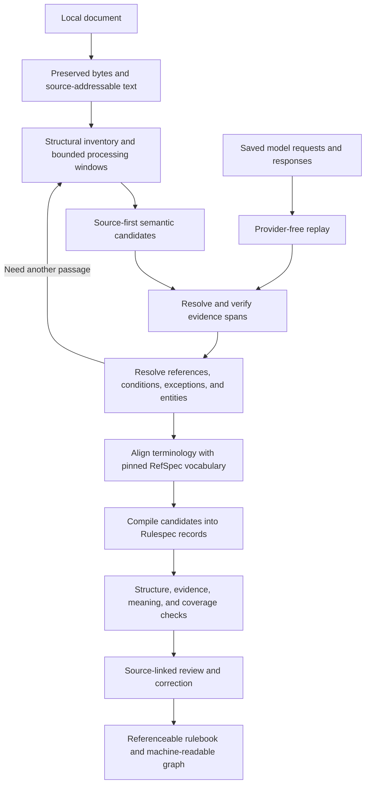

# Standalone document understanding in Rulespec

Implementation: [first local slice and remaining extraction work](2026-09-07-document-understanding-execution.md).
The new application is runnable; the historical research and rationale remain below.

Latest review: [final path forward and codebase reuse audit](../reviews/2026-09-07-document-understanding-path-forward.md).
The experimental proof of concept now exists in `examples/document_understanding/`.
The review updates the next milestone, identifies existing implementations to
reuse, and records the evaluation, identity, and replay gaps identified before implementation.

Follow-up: [LangExtract integration with Rulespec schemas](2026-09-07-langextract-schema-integration.md)
records the proposed candidate schema, mapping responsibilities, and implementation
acceptance checks. [SpicyRegs comparison](2026-09-06-spicyregs-segmenter-comparison.md)
records the recovered processing baseline and its evaluation caveats.

Status: Proposed architecture and delivery plan. The standalone product boundary
is accepted in `docs/decisions.md`; the design below is a recommendation, not an
implemented capability or a new release specification.

## Decision and findings

Build one local Rulespec application that turns a source document into a
reviewable, referenceable rulebook. It owns input preparation, semantic
segmentation, extraction, relationships, evidence verification, and evaluation.
RefSpec supplies tags, terms, and thesauri. Other platform products are not
prerequisites.

The existing repository supplies substantial representation and verification
machinery. The missing work is the semantic producer and its review/evaluation
loop. Preserve the useful machinery and organize development around the output
a person can inspect.

| Finding | Evidence | Decision |
| --- | --- | --- |
| The current model-output assembly path primarily represents concept tagging. | `projection.py:881` defines `ConceptJudgment`; `:975` validates tag candidates; `assemble()` emits model judgments as `ConceptAssignment`. | RESHAPE: add a semantic producer for requirements, definitions, conditions, exceptions, and entities. Reuse evidence helpers without treating every result as a tag. |
| Source grounding already has useful implementations. | `evidence.py:44` resolves exact quotes; `projection.py:225` re-slices and hashes fragments; `constraints/core/evidence-binding.cue` supports multiple source fragments and evidentiary functions. | KEEP: build on exact fragments and existing evidence records. |
| Core can represent assertions, but generic rule structure remains a design gap. | `constraints/core/relationship-assertion.cue`, `value-assertion.cue`, and `applicability-scope.cue`; the latter records its condition as free-form text. | RESHAPE: define a small document-understanding profile using worked rules, including condition grouping and exception scope. |
| Existing release formats impose upstream identities and selection receipts beyond a local experiment's needs. | `spec/rulespec-releases.md` §3; `tools/rulespec_release.py:1058`; `tools/extrapolation_release_v2.py:2274`. | DEFER their use as the local run format. Keep their validators for actual compatible exchanges. |
| Existing conformance is necessary but does not measure extraction correctness or omissions. | `tools/conformance_report.py:111`, `:192`, and `:256`; `tools/test_projection_conformance.py`. | KEEP those checks and add source-based evaluation with independently labeled examples. |

Paths named `projection.py` and `evidence.py` above are under
`packages/rulespec-projection/src/rulespec_projection/`.

## Product experience

The target is a local application with a command-line entry point and a local
review interface. A user opens a manual, runs analysis, and receives:

- A source view with its structure and highlighted passages.
- A rulebook containing requirements, prohibitions, permissions, definitions,
  procedures, evidence requirements, conditions, exceptions, and entities.
- A detail view for each item: precise statement, constituent claims, supporting
  and qualifying passages, related items, terminology matches, and review state.
- Coverage results showing inspected, excluded, failed, ambiguous, and
  unresolved material.
- A machine-readable Rulespec graph and a replayable record of the run.

The user can split or merge a proposed item, correct a relationship, reject an
interpretation, and trace the revised result to the original proposal. Later,
they can analyze a revised manual and inspect proposed changes to the rulebook.
This is the ambitious product destination. Automatic adjudication of individual
cases would require a separately specified and validated execution model.

## Three structures within one workflow

Keep three distinct structures because they answer different questions:

1. **Source structure:** which page, heading, paragraph, list item, or table cell
   contains the text?
2. **Processing windows:** which exact source material was supplied to one model
   call, including surrounding context and referenced passages?
3. **Semantic units:** which passages together express one requirement,
   exception, definition, entity, or procedure?

Semantic units may overlap and may cite discontinuous spans. A definition may
support many requirements. Several requirements may originate in one paragraph.
A processing-window boundary never establishes a rule boundary.

## Processing design

### 1. Preserve and prepare the input

Copy the input into a run's source area and record its byte digest. An input
reader owned by Rulespec produces text, structure, and source locators. Ordinary
parsing libraries are implementation dependencies; no sibling product runs.

Preserve the original bytes separately from any extracted or normalized text.
Text coordinates name a specific text representation and parser version. PDF
page/region locators and OCR provenance are additional evidence; an exact quote
match against extracted text does not prove the parser transcribed the original
page correctly. Display the original when checking such cases.

Build a structural inventory of headings, paragraphs, lists, tables, notes, and
references. Record material the reader could not recover. A failed table or
unreadable page must remain visible in coverage.

### 2. Discover semantic candidates

Use bounded windows that preserve section ancestry, table headers, nearby
definitions, and list introductions. Ask for source-grounded candidate items
and relationships through a focused response schema.

The first pass identifies what the document says before trying to fit it to a
reference vocabulary. RefSpec terms can assist later interpretation, but lack of
a matching term must not make a requirement disappear.

Candidate records use temporary IDs, verbatim quotes, source block references,
and explicit uncertainty. Models propose spans; deterministic code resolves
them against stored text. Save raw responses, including malformed and rejected
ones, before repair or retry.

### 3. Resolve evidence

Reuse `resolve_exact_evidence_offsets()` and `verify_fragment()`. Resolve quotes
within the named source block, translate to representation coordinates, and
re-slice at the final location. Ambiguous repeated quotes require more context
or an explicit unresolved result. Do not guess an occurrence.

Each meaningful part of an interpretation needs evidence. A requirement's main
sentence does not automatically support its extracted threshold, actor,
exception, or deadline. Bind those constituent assertions separately. Use
`EvidenceBinding` functions such as `supports`, `qualifies`, and `definesScope`.

### 4. Assemble rules across passages

After local extraction, resolve section references, defined terms, actor
mentions, condition groups, and exception targets over the document inventory.
Fetch the relevant local passages for a focused follow-up call when required.
Bound the number of follow-ups and record unresolved references when the source
or budget does not permit resolution.

The document-understanding profile should represent:

- who must, may, or must not perform an action;
- the action, its object, and any required evidence;
- applicability and temporal conditions;
- conjunctions and alternatives, preserving AND/OR grouping;
- exceptions and exactly which requirement or clause they modify;
- procedures and ordering when the source states an order;
- definitions and scoped entity references;
- direct statements versus interpretations assembled across passages.

An asserted prohibition is an affirmed statement about a prohibition. It is
not automatically a denied `RelationshipAssertion`. Existing assertion polarity
cannot stand in for obligation, permission, or prohibition.

Do not infer that missing text means false, inapplicable, or unrestricted. Mark
unknown conditions and unresolved external references explicitly.

### 5. Align vocabulary through RefSpec

Pin the exact vocabulary supplied by RefSpec. Retrieve plausible terms and
their definitions, then assess the mapping using the source context. Retain the
chosen term, alternatives, match basis, and unresolved state.

Reuse `VocabularyConcept` where its fields fit. The current production RefSpec
API and transport were not inspected in this review; define the adapter only
after checking that interface. Do not invent or mirror a RefSpec registry.

Entity mentions and source-local meanings survive without a vocabulary match.
Core already supports `LocalConcept`, but publishing or promoting one into a
shared thesaurus remains separate. The current `verify_candidate_rows()` rejects
novel/unresolved tags; that refusal must not delete source-derived rule content
from the new workflow. A `ConceptAssignment` requires valid release membership,
so pending mappings remain pending until that proof exists.

### 6. Compile into Rulespec records

Keep model response objects small and suited to extraction. A deterministic
compiler converts admitted candidates into the canonical graph:

| Product fact | Existing representation to reuse |
| --- | --- |
| Source document or text representation | `Artifact`, with an exact content digest |
| Exact evidence span | `SourceFragment` and its selector |
| Relationship or literal assertion | `RelationshipAssertion` or `ValueAssertion` |
| Evidence supporting or qualifying a claim | `EvidenceBinding` |
| Vocabulary association | `ConceptAssignment` with an exact concept release |
| Local meaning where appropriate | `LocalConcept`, scoped according to Core |
| How extraction occurred | `ExtractionActivity` and `AILineage` |
| Review decision | Scoped `Attestation` |
| Revised interpretation | New assertion and derivation/supersession links |

Define rule resources and the predicates connecting their parts in a new
Rulespec-owned profile under `constraints/profiles/`, with matching specification
and fixtures. The precise names remain proposed until worked examples establish
their meaning. Keep universal evidence and assertion rules in Core.

The profile is the authoring source. Generate its schemas and types through the
existing compiler. Derive a model-compatible response view where possible;
where a simpler response shape is necessary, test the explicit conversion into
canonical records so it cannot become a second competing semantic definition.

### 7. Validate, review, and replay

Use four distinct assessments:

| Assessment | Question | Evidence |
| --- | --- | --- |
| Structural conformance | Is the representation valid? | Generated JSON Schema, existing SHACL, explicit profile constraints and graph-reference checks |
| Source grounding | Are quotes, coordinates, identities, and referenced passages correct? | Deterministic source replay and parser/original-source inspection where needed |
| Interpretation quality | Does the evidence support the rule, including conditions and exceptions? | Source-based human labels and independent model critique as diagnostic evidence |
| Coverage | What did the workflow inspect, miss, exclude, or fail to process? | Processing ledger plus independent expected-item and relationship evaluation |

Separate mechanical processing coverage from semantic completeness. Recording
that every paragraph was visited does not prove every requirement was found.
Reserve holdout sections whose labels are never included in extraction prompts,
term retrieval, or repair feedback during evaluation.

Persist model requests/responses and their digests, input windows, vocabulary
pin, profile/prompt versions, stage outcomes, rejections, and review edits.
Provider-free replay reuses saved responses and reruns deterministic stages.
A fresh model call is a new attempt even with identical settings; temperature
zero is not a reproducibility guarantee.

## How the repository should support the application

Use a Rulespec-owned application package, provisionally
`packages/rulespec-extrapolator/`. Give it ordinary modules for input reading,
processing windows, extraction, rule assembly, vocabulary alignment, graph
construction, validation, and local review. These are modules in one application,
not separate services. A local SQLite run store can track tasks, records, and
dependencies while files retain original inputs and large responses.

The only replacement interfaces initially needed are the model client (live
calls versus replay), input readers (actual supported file formats), and the
RefSpec vocabulary reader. Add other abstractions only when a real second
implementation needs them.

| Existing area | Treatment |
| --- | --- |
| `packages/rulespec-projection/` | Reuse exact evidence and provenance mechanics. Preserve existing tag-producer behavior and its parity tests while adding the general semantic path. |
| `ProfileFacts` / `DeterministicEdge` | Keep for source-table facts. Do not label model-derived rules as deterministic table relationships to fit the current assembler. |
| `rulespec_conformance.contract` | Consume generated terms and packaged schemas. |
| `rulespec_conformance.ci_validate.validate_one()` | Reuse the SHACL and reference-release integrity path. It is not a complete standalone extraction validator. |
| `tools/conformance_report.py` | Reuse or factor the necessary L2 mechanics into a supported callable path; avoid importing the entire repository report as the application engine. |
| Rust runtime | Keep for its existing usage/lifecycle/concept behavior. It is not currently a passport requirement evaluator. |
| `rulespec-artifacts` | Use for sealed exports when needed; local mutable run state has a different purpose. |
| Extrapolation release v1/v2 | Use only for outputs that satisfy those formats. Do not fabricate DocSpec/SpicyRegs releases or validation receipts to run locally. |
| Wiki and old TODOs | Navigation aids. Current source, specifications, and owner clarification govern implementation. |

## Delivery sequence

Each slice should leave a usable vertical result. The destination remains the
complete rulebook experience.

1. **One hand-built rulebook through the real schemas.** Select an actual manual
   excerpt with cross-section dependencies. Author the intended output,
   evidence spans, unresolved cases, and minimal profile. Prove it can be
   represented, validated, and inspected before model behavior obscures gaps.
2. **One automated, replayable extraction.** Add one input format, one live model
   path, saved responses, deterministic grounding, graph compilation, and a
   source-linked review report. Run without sibling services; permit a pinned
   RefSpec vocabulary export.
3. **A complete chapter with cross-section rules.** Add contextual follow-ups,
   definitions, condition grouping, exceptions, duplicate proposals, and
   explicit coverage/failure accounting. Evaluate held-out items and links.
4. **A complete manual with correction and comparison.** Add the formats the
   source requires, resumable execution, spend limits, review edits, and a second
   version of the manual. Propose cross-version matches with evidence; review
   ambiguous matches.
5. **A reusable product.** Add a second distinct manual family, stable application
   interfaces, reusable extraction profiles, and compatible sealed exports.
   Let real consumers determine which release and operational features matter.

The first acceptance artifact should include at least: one paragraph containing
multiple requirements; one requirement assembled across sections; a scoped
exception; a defined term; a table/list dependency; repeated quote text; an
unresolved external reference; and a source concept absent from RefSpec.
Exact metric thresholds need the first labeled set and an explicit use target;
do not invent a success percentage before measuring the task.

## Architecture assessment

### Lineage and relationships

| Artifact | Relationship | Practical consequence |
| --- | --- | --- |
| `README.md`, From documents to referenceable knowledge | Product objective | Optimize for identifiable meaning with source evidence. |
| `docs/decisions.md`, 2026-09-06 | Owner boundary | Rulespec owns standalone semantic segmentation and validation. |
| `docs/decisions.md`, 2026-08-02, with later DocSpec annotations | Superseded for local workflow | Existing prepared-input integration cannot prevent local execution. |
| `spec/rulespec-releases.md`, standalone scope banner and §3 | Exchange boundary | Existing release meaning remains distinct from local run prerequisites. |
| `spec/rkaf-core.md` §§2, 4.2–4.7 | Representation authority | Reuse assertion origin, basis, evidence, vocabulary, and review semantics. |
| `constraints/README.md` | Compilation authority | New portable meaning starts in CUE and moves with generated targets/tests. |
| `packages/rulespec-projection/README.md` and source | Existing producer | Reuse precise source checks; extend beyond table facts and tags. |

| Component/seam | Owner | Input | Consumer | Status |
| --- | --- | --- | --- | --- |
| Local source preparation | Rulespec application | User document | Semantic extraction | Proposed |
| Semantic extraction and assembly | Rulespec application | Addressable text and saved model responses | Canonical graph compiler | Proposed |
| Reference vocabulary | RefSpec; Rulespec adapter | Pinned terms and definitions | Alignment stage | Product boundary accepted; live adapter unverified |
| Portable meaning and evidence | Rulespec Core/profile | Admitted candidates | Validators and consumers | Core exists; profile proposed |
| Review and evaluation | Rulespec application | Candidate graph and original source | Reviewer and run comparison | Proposed |
| Artifact byte integrity | Rulespec artifacts | Sealed output files | Export consumer | Exists |

### Invariants and commitments

- **Preserved:** CUE is the structural source of truth; generated targets are
  regenerated rather than hand-edited (`constraints/README.md`).
- **Preserved:** construction origin, epistemic basis, and review are separate
  (`constraints/core/assertion.cue`, `attestation.cue`). A model can extract a
  source-explicit statement without becoming its authority.
- **Preserved:** a changed proposition is a new assertion. Source-version IDs
  and assertion IDs are distinct from proposed cross-version equivalence.
- **Relied upon:** evidence must resolve to exact stored text; source parsing
  fidelity requires additional evidence beyond a text hash.
- **New application rule:** unsupported, ambiguous, failed, and vocabulary-
  unmatched candidates remain visible. They never silently count as absence.
- **New application rule:** held-out labels cannot enter extraction inputs.
- **Superseded in the authorized scope:** the earlier blanket ban on local
  segmentation does not apply to standalone validation.

### User value and counterfactuals

The beneficiary is the person trying to understand, reference, and verify the
requirements in a manual. Success is the ability to inspect a specific rule and
its dependencies without rebuilding its meaning by manually rereading the
document. The new application/profile adds debt only where the existing tagging
model cannot express that result.

Keeping the current tag-only producer as the entire product would yield useful
subject labels but fail to recover obligations, condition grouping, and exception
scope. Feeding a complete manual into one untracked model call would be quick
to demonstrate but would provide weaker localization of omissions and repairs.
The proposed staged design must earn its complexity by outperforming a simple
source-grounded baseline on the same held-out examples and review effort.

Kill or reshape the design if it produces schema-valid graphs that reviewers
cannot verify efficiently, if evidence-backed conditions remain systematically
wrong, or if setup of unrelated platform artifacts dominates the first useful
run. Six months of more validators without a usable rulebook would refute its
product-value claim.

Removing generic artifact export from the first local slice should leave the
core experience usable. Removing source anchoring or semantic rule assembly
destroys that experience. This is the priority ordering.

### Verdict and verification limits

RECONSIDER the existing producer-as-product shape: retain Core, evidence helpers,
and validation; add one standalone semantic extraction and review application
with a small rule profile. The user-value claim is supported by the stated
manual workflow. The standalone commitment is honored; added complexity is
concentrated at the missing producer and review steps.

Confidence is high in the identified tagging/semantic-extraction gap and the
reusable evidence primitives, and medium in the proposed profile until worked
examples exercise it. This review used direct source inspection plus earlier
repository investigation. It did not run extraction, inspect a passport manual,
verify the live RefSpec interface, benchmark parsers/models, or rerun the full
test suite. Generated wiki defect claims were not treated as verified blockers.
