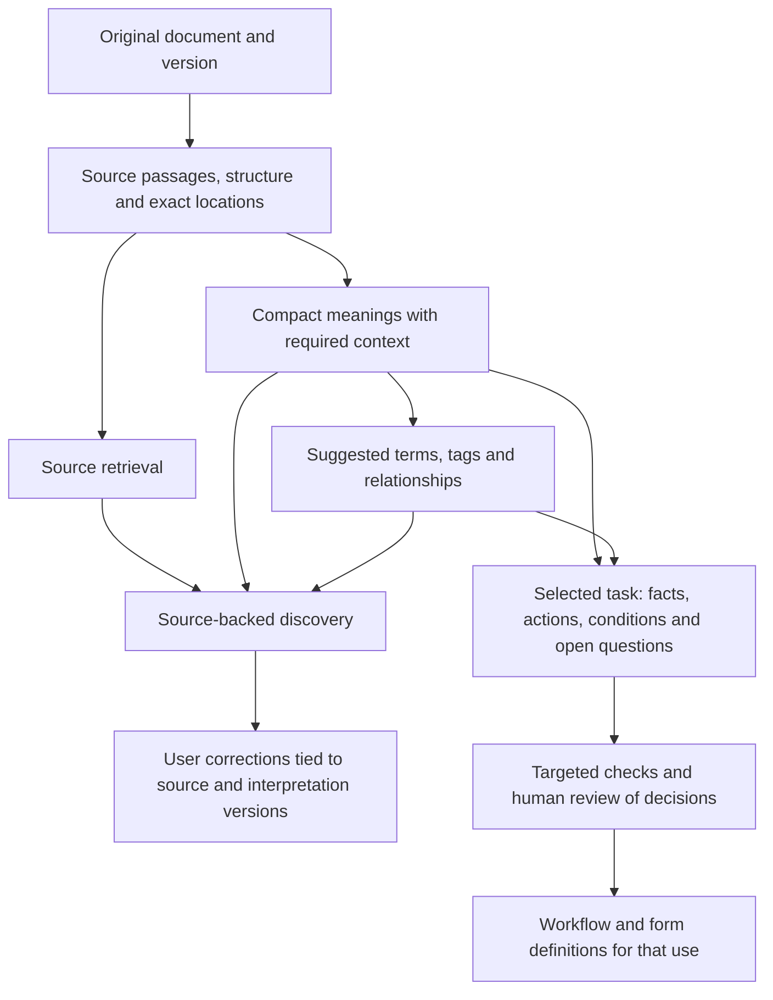

# Pipeline recommendations from three independent reviewers

**Keep one source/evidence foundation and reshape the optional refinement process
around specific tasks.** All three reviewers favor inexpensive discovery over the
whole collection, with deeper interpretation when someone needs a particular
relationship, decision, workflow, or form. They do not recommend another universal
round of model approval or exhaustive atomization at ingestion.

The reviewers received no previous conversation or conclusions for their initial
raw-data reviews. Each wrote these recommendations independently before reading
the others. The parent corrected one factual ambiguity: extraction is already
single-pass by default; audit/refinement are optional. The full chain runs inside
optional `refine_run`. Their recommendations target that chain and future product
use, not removal of a nonexistent mandatory ingestion gate.

## Their distinct recommendations

| Reviewer | Main recommendation | Most consequential change |
| --- | --- | --- |
| [A](2026-09-10-blind-process-a-recommendations.md) | One source foundation, lightweight discovery, deliberate conversion to reviewed decisions | Store relationships as individually evidenced interpretations. A permission can qualify a prohibition without duplicating its statement; a disputed target should not erase a supported target. |
| [B](2026-09-10-blind-process-b-recommendations.md) | Task-specific optional operations, followed by decision tables for selected operational uses | Stop repeating a whole inventory/recovery/challenge sequence when the desired output is a few links. Measure new useful information and reviewer effort. |
| [C](2026-09-10-blind-process-c-recommendations.md) | Source retrieval first, with cached meanings and the context they require | Stop presenting isolated child duties as independently complete. Keep context dependencies usable in search results and later workflow preparation. |

All preserve source versions, exact locations, raw captures, revisions and explicit
uncertainty. All distinguish user relevance feedback from interpretation corrections
and approval of an operational workflow. No reviewer proposes universal manual
review for discovery.

## Shared design direction

This is one shared system with different depths of processing, not a proposal for
two competing extractors. Source retrieval must remain possible when interpretation
fails. Interpretations should improve discovery and prepare review without becoming
a prerequisite for finding the original provision.

1. **Preserve source structure and context.** Headings, lead-ins, list items, tables
   and references should remain addressable. Structural parentage supplies context;
   it does not prove legal inheritance. A short reading can depend on additional
   passages, but the consumer must receive or see those dependencies.
2. **Use one primary readable meaning.** Populate actors, definitions, alternatives,
   values and other structure when useful. Avoid competing abbreviated versions of
   the same rule. Keep grouped procedures readable; give specific actions identities
   when an exception or operational decision needs that distinction.
3. **Separate relationship judgments from statement rewriting.** Preserve each
   relationship's evidence, target, disputed interpretation and review state. A
   navigation link is not automatically executable waiver logic. Independent target
   judgments are a proposed design, not a proven fix.
4. **Make deeper checks purposeful.** A missing-content investigation, relationship
   review and workflow scenario review are different tasks. Select them explicitly
   within the optional route. Keep independent audits for sampling and difficult
   cases; do not infer from empty recovery calls that omission detection is useless.
5. **Expose uncertainty in consumer outputs.** A rejected interpretation should not
   vanish merely because no edit applied. Model agreement, exact grounding, no
   detected defect and human approval for a use are different facts.
6. **Prepare workflows for named activities.** Identify facts to collect, applicable
   branches, actions, deadlines, exceptions and unknowns. Review those decisions and
   representative scenarios before translating them to workflow/form specifications.

## What this means for the existing code

The source/evidence foundation already exists. `README.md`'s “From documents to
referenceable knowledge” section requires standalone local validation, source
traceability, and separation of interpretations from direct statements.
`extraction.passage_catalog` / `resolve_passage` provide exact selections;
`ReviewStore` retains revisions; `discovery.export_discovery` already exports every
source passage even when no statement links to it. Reuse these rather than build a
parallel pipeline. RefSpec remains the external vocabulary source where needed.

Core already provides `RelationshipAssertion` and `ApplicabilityScope`; the latter's
free-form condition is expressly audited rather than validated. Availability of
those shapes does not decide which action a qualification affects. Some proposed
changes belong in the document-understanding profile and consumer views, not in a
new Core schema. Check actual graph consumers before deferring or deleting eager
Core generation: the reviewers proposed generating detailed graphs on demand but
did not audit repository-wide interoperability obligations.

Compact existing-exemption link edits have already been implemented locally and
verified. That addresses one duplication source, not all the representation and
scope problems above. The broader recommendations remain unimplemented.

## What to test before a redesign

**First: does extracted meaning improve the actual discovery task?** Compare
source-only retrieval, current meanings, and source plus meanings/context on held-out
documents and queries. Measure relevant-source retrieval, missing qualifications,
duplicate results, latency and cost. Use a small retrieval harness; a new search
product is not required to answer this question.

**Second: does a context-bearing result improve interpretation?** Compare isolated
statements with the same statements plus necessary source context. Use fresh nested
permissions/exceptions as well as the saved failures. Measure correct readings and
review time. Treat the child-restraint notwithstanding/exclusion interaction and
phone carrier applicability as disputed interpretations, not forced binary labels.

**Third: can targeted checks earn their cost?** Compare the full optional route with
specific omission/relationship investigations. Count defects caught, defects
introduced, correct links retained, visible unresolved questions and reviewer effort.
If the intended behavior is considering every target, make that behavior observable;
the previous matrix prompt alone did not establish it happened.

**Then: complete one reviewed operational example.** Compare source-only preparation
with a generated decision draft for a named workflow. Measure corrections, omitted
applicability questions, unsupported actions/form fields and time saved. Only that
test can justify the proposed operational representation.

These recommendations are grounded in selected source captures but their proposed
benefits remain hypotheses. Agreement among three agents is not an independent
accuracy benchmark. No new model calls or production changes were made for this
recommendation task; the earlier local implementation remains uncommitted.
