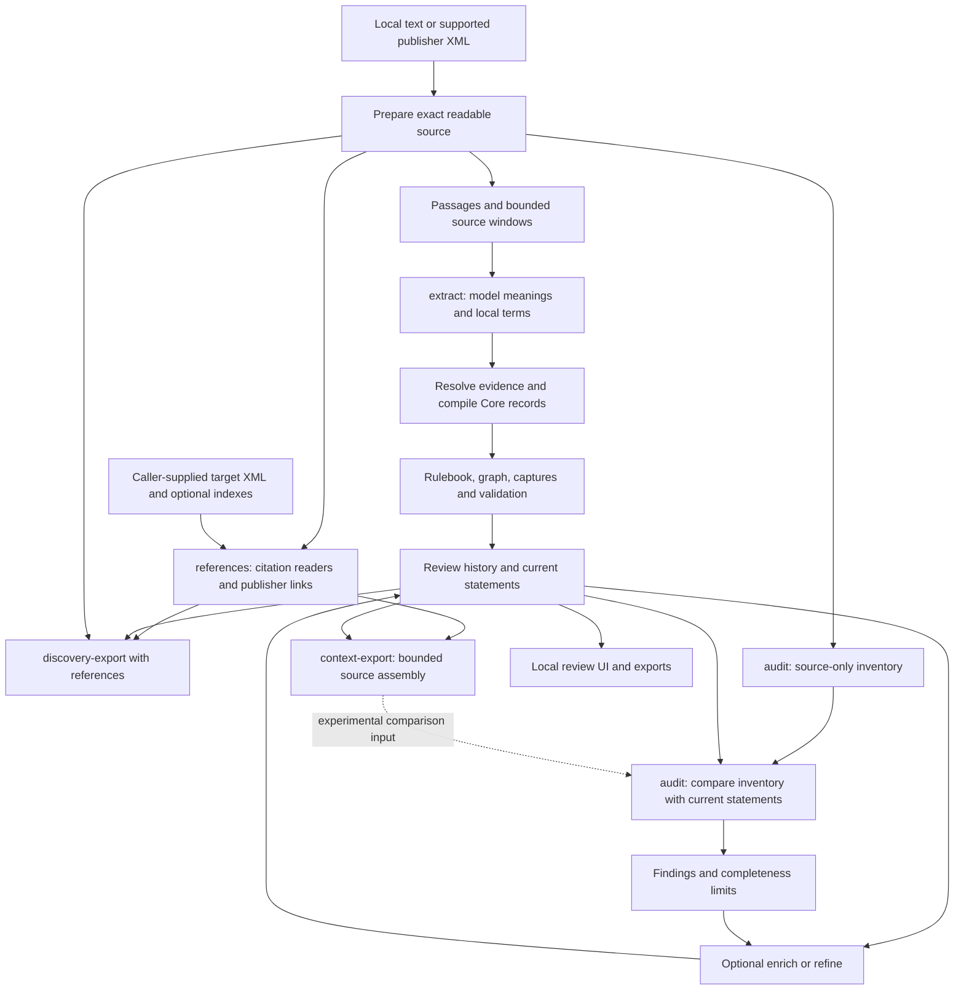

# End-to-end extraction and reference integration trace

**Result:** the identifier work is useful and has real consumers. The unresolved
problem is carrying the meaning of located passages into complete statements and
reliable qualification links. The installed application contains separate,
working stages; it does not yet run them as one automatically enriched process.

Code baseline: `854bb2a`, reviewed 2026-09-11. Scope: the public
`rulespec-understand` commands, their supporting code, installed source readers,
and saved extraction/context/audit examples. No provider calls, production code
changes, source-capture edits, dependency upgrades, or review mutations were made.
This is a process trace, not a new estimate of general model accuracy.

Code references below abbreviate
`packages/rulespec-extrapolator/src/rulespec_extrapolator` as **APP**. Line numbers
refer to this baseline. Probe results and selected raw records are retained in
[end-to-end-trace-checks.json](2026-09-11-end-to-end-trace-checks.json).

## Findings first

| Priority | Observation | Practical consequence | Disposition |
| --- | --- | --- | --- |
| High: integration gap | Normal extraction, audit and refinement do not consume `context-export` or its richer citation target readings. Claim `reference_links` use a simpler section-label lookup. | A source can be located by the reference reader while the statement still reports an unresolved reference and its checker never receives that target. | Preserve the reader and export; any model consumer must connect them explicitly and be evaluated separately. |
| High: meaning limitation | The equipment run captures an overriding permission separately, with no relationship to the earlier prohibition. Expanded comparison receives the override but approves the opening statement. | Source retention, valid evidence and complete standalone meaning are different outcomes. | Test qualification discovery and attachment, not just increased comparison context. |
| Medium: verified implementation inconsistency | `core.evidence_parts` accepts an exact quotation across inserted whitespace by retaining its original source pieces. `audit._source_span` rejects every span crossing inserted text, including whitespace. | Native XML evidence that works in extraction/context can fail inventory, audit judgment or refinement-check decoding. | Reuse compound evidence handling in audit while retaining the refusal of inserted substantive content. Not fixed in this review. |
| Medium: bounded coverage | Audit selects claims by their starting position and inventory units by their window. Additional claim context comes only from already linked outgoing targets. Normal term registration is also local to a model response. | Cross-window qualifications and definitions need explicit handling; proximity and a complete processing count do not supply those links. | Preserve source-wide discovery records; evaluate broader inventory/term context where it addresses demonstrated misses. |
| Medium: reader coverage | Native preparation accepts supported USLM and eCFR roots; GovInfo annual CFR XML remains unsupported. | Identifier recognition can work on annual text without native annual structure and source mapping. | Extend RefSpec's existing reader under R23. Do not replace citation or evidence work. |
| Consumer constraint | Text document IDs exclude title/URL metadata; rule IDs include extraction run and candidate position. | These are not universal legal identities or automatic cross-edition rule correspondence. | Preserve publisher/version information and state the intended scope of each ID. |

The first finding follows `APP/cli.py:183–216`, `extraction.py:634`,
`audit.py:238–314`, `refinement.py:139`, and `core.py:302–329`. The second is walked
through below. The third follows `core.py:123–147`, `audit.py:174–197`, and
`refinement.py:342–364`; the saved deterministic probe reproduces it. The remaining
findings are detailed in the stage and identity tables.

## Intent and current delivery

The original objective remains source-faithful, referenceable rules, definitions,
conditions and relationships, usable for discovery and for subsequent reviewed
tool preparation. Local validation is independent of a running DocSpec or Spicy
Regs system. Rulespec itself is not a search engine or workflow execution engine.
Evidence: `README.md`, “From documents to referenceable knowledge” and “What
Rulespec is not”; `docs/decisions.md`, 2026-09-06 standalone validation decision.

| Decision or workstream | What exists now | What remains outside this result |
| --- | --- | --- |
| Meaning-first extraction | A complete primary statement with sparse optional fields and exact source evidence | Proof that every statement retains every governing condition |
| Existing Core reuse | Assertions, fragments, evidence roles, applicability, concepts, lineage, findings, revisions and attestations | A schema that decides legal meaning by itself |
| Reference integration, R3–R14/R23 | Reusable readers, source mappings, publisher links, selected caller-supplied target bodies and provenance | General prose paragraph navigation, all qualified target bodies, edition correspondence and annual XML |
| Context integration | Deterministic `context-export`, committed in `6942225` | Automatic use by extraction/audit/refinement; the latest comparison failed its adoption gate |
| Discovery and feedback, R17–R18 | Full-source discovery export, current statements and pinned reference feedback | Measured improvement in a real search consumer and an automatic feedback-resolution process |
| Workflow preparation, R19 | Suitable evidence/review foundation | Demonstrated reviewed WOS/Formspec workflow generation |

Lineage: [reference task list](../plans/2026-09-10-reference-integration-task-list.md),
[context integration plan](../plans/2026-09-11-context-work-integration.md), and
[latest comparison decision](../experiments/2026-09-11-context-audit-comparison/RESULTS.md).
The task list distinguishes completed slices from remaining scope. A completed
reader slice does not mean its downstream model application was also delivered.

## Actual flow

Each named command is separately invoked. Arrows show data dependencies, not an
automatic command sequence. The dashed connection exists only in the experiment.

### 1. Prepare the source

**Input:** a local UTF-8 text file, a prepared-document JSON file, or supported
publisher XML. `load_document` does not implement general PDF/HTML acquisition.

**Work:** plain text receives a text digest, document identity and a fallback
section covering the document. Native XML preparation reuses
`refspec.registry.xml_text.read_text`; it retains structural sections, original
XML, the XML digest, reader method and a mapping from prepared characters to
decoded source characters. Inserted separators are explicitly marked. XML
element paths identify original nodes; prepared text offsets are Unicode
character positions, not raw XML byte offsets.

**Output/check:** `document.json`; validation checks text hashes, sections and
continuous source-map accounting. Native re-reading checks the pinned XML,
method and exact prepared result. This verifies the representation against the
chosen reader, not that the reader understood every table or legal structure.

Evidence: `APP/documents.py:10–81`; `uslm.py:11–66,100–117`; installed
`refspec/registry/xml_text.py:14–63`. The installed reader currently admits USLM
`uscDoc`, eCFR `ECFR`, or supported typed `DIV` roots, not `CFRGRANULE`.

The latest annual experiment used DocSpec only to acquire a frozen text rendition.
That rendition includes metadata such as dates, a literal `false`, and repeated
title material ahead of the provision, and has one fallback section. It therefore
tests extraction from that text, not clean native annual structure. This is
another reason for an annual reader, independent of model quality. Source:
`context-audit-comparison/extract/annual-14-91-213/document.json` and
[source preparation report](../experiments/2026-09-11-context-audit-comparison/SOURCE-PREPARATION.md).

### 2. Divide text for location and model requests

**Work:** `source_passages` creates deterministic passages using paragraph/list
boundaries and available sections. Parent relationships describe detected source
structure; they do not assert that one passage legally governs another.
`plan_windows` covers the source with bounded focus windows, trying to retain
fitting list groups. `with_context` adds available ancestors and neighboring
passages under a separate allowance, recording truncation/omission.

**Output/check:** window offsets, hashes, passage IDs, and request-local `F...`
focus/`C...` context IDs. Main extraction must select focus text; supporting
evidence may select supplied context. The resolver refuses missing IDs and ranges
that would cross unsupplied substantive text. It reconstructs the exact source
slice rather than asking the model to reproduce long evidence quotations.

Evidence: `APP/documents.py:85–196`; `extraction.py:223–333`.
Default extraction focus allowance is 24,000 characters. Context selection is
still bounded even when the model supports a much larger context window.

### 3. Ask for source meanings using the generated schema

**Input:** source catalog, prompt and generated provider schema. The ordinary
request does not contain a rich citation scan, external target bodies or a
cross-document vocabulary inventory.

**Work:** Gemini through LangExtract returns a term index followed by semantic
units. Each unit has one complete `statement`, a source selection, kind, modality,
actor fields and optional scope/choice/logic/reference fields. Optional fields may
be absent/null. `logic_quote` selects verbatim evidence; it is not generated
reasoning. Conditions belong in the complete statement even when structured
scope is omitted. The ordinary pass asks for complete meanings and does not
create separate condition/exception relationship records; refinement is the
optional later path for those links.

The CUE application profile imports relevant Core types. The build script uses
upstream CUE's JSON Schema encoder, inlines local references for the provider and
restores titles/order. It does not implement a second CUE compiler. The smaller
provider profile and richer candidate/review profile have different purposes.

**Output/check:** actual requests, raw responses, usage, schema/prompt/runtime
fingerprints and refusal details are saved. The live CLI defaults are
`gemini-3.8-flash`, temperature 0, low thinking, 16,384 output tokens; settings are
configurable. The latest experiment explicitly used 32,768 output allowance.

Evidence: `APP/extraction.py:30–139,217–220,634–722,796–873`;
`schema_data/document-understanding.cue:92–173,231–291`;
`tools/build_extraction_schemas.py:22–137`. LangExtract supplies provider/schema
plumbing; Rulespec supplies the window plan, meaning profile, grounding and Core
compilation.

### 4. Ground and compile the response

**Work:** parse the raw provider text, validate its structure and resolve source
IDs. `statement` becomes the internal `summary`. Missing optional fields get
internal empty values without inventing extra meaning. Invalid main evidence
refuses the row; invalid optional evidence is withheld and reported. The original
response remains intact.

The local term index must identify a supported definition and its name/aliases.
Model-local IDs become durable local term IDs, and term references become links.
Normal parsing resolves this within one response; it does not carry all prior
windows' definitions forward or automatically map an acronym into RefSpec.

Core compilation assigns rule/revision/assertion identities and emits existing
Core records. Main evidence supports meaning; verified scope can define an
`ApplicabilityScope`; context and qualification evidence retain their distinct
roles. Optional richer structures can use existing concept assignments, typed
values, attribution and effective periods when populated. Their availability does
not mean the normal extractor fills all of them.

**Output/check:** `candidates.json`, `refusals.json`, `rulebook.json`,
`graph.jsonld`, `validation.json` and a hashed manifest. Shape, selectors,
references and graph constraints are checked. No check proves semantic
completeness and no `ClosureClaim` is inferred from a successful extraction.

Evidence: `APP/extraction.py:335–441,756–793`; `terms.py:33–92,135`;
`core.py:35–99,123–149,161–353,379–535`.

**Important unresolved connection:** `core.resolve_links` checks extracted
reference strings against exact normalized section labels/IDs. It does not call
the rich reference reader. Qualification targets are explicit current claim
identities, not citation strings or inferred proximity (`core.py:302–329`).

### 5. Read citations and assemble context, when requested

**Input:** the complete prepared source, optionally named-act/source-credit
indexes and caller-supplied supported XML target documents. This step can also
run without an extraction.

**Work:** `references` reuses SpicySearch identifier recognition and RefSpec
citation grammars, named-act/source-credit readers and publisher XML links.
USLM native links retain exact XML occurrence and target identities; text and
publisher readings are associated without silently declaring them equivalent.
Lookup distinguishes located, ambiguous, unavailable and unsupported targets.

Caller-supplied lookup supports selected USC sections/pinpoints and simple CFR
section targets. Qualified CFR readings can be preserved even where target-body
lookup is unsupported. Cross-source edition correspondence remains
`not_established`. There is no automatic network fetch or recursive expansion.

`context-export` assembles a focus claim or source span, existing evidence,
ordinary context, a bounded containing section, already linked claims and
one-hop uniquely located targets. It separates source catalogs (`S0`, `S1`, ...)
and records budget decisions, source metadata and relevant recorded feedback.
It does not decide which imported clause applies or edit the statement.

**Output/check:** an inspectable reference scan or context file; every model
selection can be resolved back into its supplying source. Plain source/dataset
hash utilities elsewhere in Rulespec are a separate identity concern; the
extrapolator currently uses `rulespec_projection.provenance.canonical_json`.
Its wider shared-artifact work is not an implicit model-processing stage.

Evidence: `APP/references.py:18–148`; `uslm.py:69–195`;
`reference_sources.py:19–118`; `context.py:29–198`; installed
`refspec/registry/uslm.py:164–238`; `core.py:12–20`;
`packages/rulespec-projection/src/rulespec_projection/provenance.py:1–12,80–88`.

### 6. Audit the current extraction, when requested

**Input:** a fixed rulebook and its source. Audit makes its own windows, normally
3,000 characters, with ordinary bounded context. It does not reuse the extraction
window size or accept the richer context export through its CLI.

**Work:** first inventory source meanings without showing the draft. Then compare
the draft against that inventory and source. Claim aliases are `C0000`, unit
aliases `U0000`; these differ from passage context IDs. The source inventory is
another fallible model output, not independent human ground truth.

Only claims starting in the focus window and units assigned to that window are
judged. Extra related-claim context comes from outgoing `target_ids` already
present on focus claims. An unlinked override elsewhere is not automatically
included as a claim to compare. The source might nevertheless be supplied as
context; supplying it and interpreting its effect are separate checks.

**Output/check:** source inventory, judgments, evaluation, source accounting,
Core findings and raw captures. Decoding checks source selections, expected
aliases and reciprocal claim/unit links. Audit never applies edits and always
retains `semantic_completeness=not_established`.

The separate `evaluate` command accounts for supplied source labels and reviewer
judgments. It refuses stale/malformed inputs and does not count unjudged rows as
passes. Its `passed` result means the supplied, current judgments satisfy the
accounting checks; it does not independently establish that the reviewer was
right (`evaluation.py:132–139,210–280`).

Evidence: `APP/audit.py:181–220,238–326,326–523`. Its strict evidence helper at
174–178 is the inserted-whitespace inconsistency reproduced in the receipt.

### 7. Enrich or refine, when requested

`enrich` works on existing claims to fill missing actors, definitions and term
references. It preserves populated values and records conflicts/other failures.
Validated additions are applied as AI review events.

`refine` uses a matching saved audit or runs one, proposes recovered meanings and
relationships, previews each change through the normal review path, and asks a
model to challenge the proposal against source. Supported proposals can be
applied with a current-revision check. It then runs another audit and retains
before/after/refusal records. The final audit does not automatically roll back
already applied changes. The current challenge handles a proposal and its targets
together; isolated per-target verdicts remain R25 work.

Neither command consumes `context-export`. Their checks reduce mechanical and
some semantic errors but remain fallible model judgments.

Evidence: `APP/structure.py:96–189`; `refinement.py:139–179,249–416,436–558`;
[R25](../plans/2026-09-10-reference-integration-task-list.md#r25--test-separate-relationship-verdicts-without-extra-generated-prose).

### 8. Review, feedback and the UI

`ReviewStore` verifies the base and appends edits, splits, merges, additions,
approval/rejection or observations in transactional, hash-linked history. Edits
produce new revisions; original model captures stay unchanged. Changed or
unavailable qualification targets are exposed for reconfirmation rather than
silently redirected.

The current snapshot includes pending statements in `accepted`; that name means
retained current candidates, **not human-approved facts**. Its graph retains all
revisions and review evidence. Consumers wanting current discovery statements
should use the current list/discovery export rather than treat every historical
graph assertion as simultaneously current.

Reference feedback pins the challenged scan, occurrence, reader versions and
selected target/source evidence as an observation. It reports a dispute; it
neither repairs the reader nor changes the claim automatically.

The local UI serves this snapshot and review actions. It may display a separately
supplied saved audit and marks it stale when the reviewed content changes. It
does not run extraction, richer context retrieval or audit through its HTTP
endpoints. Review approval records an assessment of meaning/evidence; it does not
authorize operational use automatically.

Evidence: `APP/review_store.py:297–375,377`; `reference_feedback.py:8–74`;
`review.py:28–54,110–170`; `core.py:427–533`.

### 9. Export to discovery or downstream preparation

`discovery-export` retains every source passage, including passages without an
extracted statement. It adds sparse current statements, local terms, evidence
references/roles, qualification targets, review status and processing accounting.
It groups shared evidence locations and omits literal duplicate choice/logic
text equal to the primary statement. It does not merge merely similar meanings.
With `--references` or supplied reference inputs, it adds the rich scan.

This is a useful input for the original tagging, embeddings and knowledge-graph
use case even when nobody has manually approved every statement. Source passages
remain discoverable when extraction is incomplete. Actual embeddings, ranking,
search deployment and user-benefit measurement belong to the consumer and remain
outside these commands. A reviewed workflow/form preparation demonstration is
also still open under R19.

Evidence: `APP/discovery.py:52–139`; `cli.py:183–216`; task list R17, R19, R22.

### 10. Reproduce the processing

`replay` verifies saved inputs/runtime and reparses raw responses, recompiles the
rulebook/graph and checks recorded results without a model call. Runtime or
artifact drift fails loudly. It is not a rerun of the model and does not claim
the provider would generate the same answer again.

`reprocess` applies current parsing/compilation to verified old captures in a new
directory and records the processing change. It preserves original acquisition
inputs and model run identity, distinguishing a code-processing change from a
fresh extraction. Replayable wrong meaning remains wrong meaning.

Evidence: `APP/extraction.py:1141–1299`.

## Identifier meanings and limits

| Identity | What it identifies | Scope/limit | Code |
| --- | --- | --- | --- |
| Document ID/digest | Exact prepared text | Same text with different title/URL produces the same ID | `documents.py:10–22` |
| Native XML source ID | Supplied XML bytes | Distinguishes captures; does not prove which edition legally applies | `uslm.py:24,69`; `context.py:25` |
| Durable passage/fragment ID | Source plus text coordinates, with fragment quote digest | Stable for the same source/positions, not across arbitrary text edits | `documents.py:133`; `core.py:123–149` |
| `F...`, `C...`, `S...` | Supplied source locations in one request/export | Request-local aliases, never global legal identities | `extraction.py:291–333`; `context.py:157–198` |
| Model-local term ID | One response's definition entry | Requires source-backed conversion before reuse | `terms.py:33–92` |
| Local term ID | Grounded definition identity | No automatic equivalence across documents, versions or repeated definitions | `terms.py:7–30,95–133` |
| Rule ID | Extraction-lineage rule | Includes run and candidate index; changes on a fresh extraction | `core.py:341–356` |
| Revision/assertion IDs | A saved meaning revision or canonical assertion | Preserve history; do not imply truth | `core.py:237–274,356–377` |
| Citation occurrence/target ID | A written reference occurrence or native target in a pinned source | Location is separate from applicability and edition correspondence | `references.py:66`; `uslm.py:119–155` |
| Audit claim/unit aliases | Rows to compare in a frozen audit | Checks association consistency, not semantic correctness | `audit.py:238–253` |

The identity-scope probes confirm both text-only document identity and fresh-run
rule identity changes. These are consumer constraints, not proof of broken hashes.

## Saved-data walkthrough A: the overriding equipment permission

Input: the frozen 4,930-character annual 14 CFR 91.213 rendition. Current code
reparsed its saved raw response into identical candidates and recompiled identical
accepted claims. There was one extraction window covering the whole source.

1. The raw first row selects `F013`, characters **341–525**, the opening paragraph
   (a). It says the takeoff prohibition has the paragraph (d) exception and requires
   conditions (a)(1)–(a)(5). The parser/compiler retain that wording as C0000,
   `kind=prohibition`, `modality=must_not`, with exact main/scope evidence.
2. The final raw row selects `F040`, characters **4506–4725**, paragraph (e). It
   preserves the special-flight-permit permission beginning “Notwithstanding any
   other provision of this section.” The compiler retains it as C0013,
   `kind=permission`, `modality=may`.
3. Both have empty `target_ids`. Extracted textual references remain unresolved
   by the simple section-label lookup. The whole extraction did retain (e); the
   standalone opening statement lacks its effect.
4. The tested audit focus is **0–2362**, with ordinary context **2362–2625**. It
   judges C0000–C0009. Its source inventory contains no special-flight-permit unit;
   C0013 is outside this comparison and no linked claim brings it in.
5. Comparison A lacks the (e) source text. Comparison B's assembled context
   includes it. Both return all dimensions of C0000 as `correct`, cite only
   `S0/F013` for that judgment, and explain the paragraph (d) exception only.

**Interpretation:** this is a missing qualification connection and a semantic
checker failure. It is not a lost raw passage or failed passage-ID lookup. The
extractor originally saw the complete section; increasing only the later
comparison context did not address the missing relationship. The shared inventory
and window-local task are plausible contributors, not established causal facts.

Sources: [raw extraction](../experiments/2026-09-11-context-audit-comparison/extract/annual-14-91-213/attempt-0000.response.json),
[compiled rulebook](../experiments/2026-09-11-context-audit-comparison/extract/annual-14-91-213/rulebook.json),
[A comparison](../experiments/2026-09-11-context-audit-comparison/comparison/cell-00/raw-decoded.json),
[B comparison](../experiments/2026-09-11-context-audit-comparison/comparison/cell-01/raw-decoded.json),
and the compact [trace receipt](2026-09-11-end-to-end-trace-checks.json).

The experiment widened comparison context while holding inventory fixed. It used
an experimental source-qualified encoding, not a byte-identical ordinary CLI
control, and supplied no external target body. Its results therefore cannot
establish that all identifier integration lacks value. See the original
[limits and failed adoption decision](../experiments/2026-09-11-context-audit-comparison/RESULTS.md).

## Saved-data walkthrough B: a definition's actual referent

The retained definition of **State agency** at characters **10516–10691** says
the agency is designated or authorized under section 49c, retaining the stated
section 49l–2 exception. Its ordinary `reference_links` are unresolved.

The native USLM scan reads the publisher href **`/us/usc/t29/s49c`** and locates
one target in the same pinned XML source. `context-export` adds the target section
at **27585–29982**, with `edition_match=same_supplied_source`. The relevant
paragraph at **27642–28018** identifies the Governor, State statute and necessary
powers to cooperate with the Secretary. Current context assembly grounded all
**43 supplied passages** through `resolve_context` in this review.

In the earlier saved focused question comparison, A correctly says the supplied
definition alone does not state who designates the agency. B uses the linked body
to answer that question and cites the definition and target passage. This is a
concrete benefit from identification plus body assembly. It remains one saved
question result, not proof that automatic extraction/audit reliably does this.

Sources: [saved cases](../experiments/2026-09-11-integrated-context-check/cases.json),
[A answer](../experiments/2026-09-11-integrated-context-check/cells/cell-04/decoded.json),
[B answer](../experiments/2026-09-11-integrated-context-check/cells/cell-05/decoded.json),
and [current assembly receipt](2026-09-11-end-to-end-trace-checks.json).

## Invariants, counterfactuals and verdict

| Invariant | Evidence/status |
| --- | --- |
| Generated meaning remains distinguishable from quoted evidence | Separate statement/source fields, evidence resolver and original captures; verified code/data trace |
| Inserted formatting must not become invented source words | Core/context preserve original pieces; verified audit inconsistency needs alignment |
| Review history does not overwrite original extraction | Immutable revisions/captures, transactional review state; traced current code |
| Citation navigation does not automatically establish applicability | Reader/context status fields and no implicit qualification creation; traced code and both examples |
| Processing validity is separate from semantic completeness | Discovery/audit accounting, explicit `not_established`; saved equipment counterexample |
| Installed application matches reviewed Python source | All 22 top-level application Python modules matched byte for byte in the saved check |

Removal probes clarify the value of each piece:

- Without passage IDs, the model must reproduce more source wording and the
  application must locate those quotations. Keeping passage IDs gives an exact,
  inspectable selection path; it does not select the right meaning for the model.
- Without rich reference reading, the State agency definition remains navigable
  only by manual lookup in this example. Removing the reader loses demonstrated
  context, even though normal extraction/audit do not yet consume it.
- Without all-source discovery records, unextracted passages can disappear from
  downstream discovery. Retaining them limits that failure without claiming all
  their meanings were extracted.
- Without audit, the current result loses an optional source-comparison signal.
  Treating audit approval as absolute, however, accepts the equipment failure.

**Verdict:** retain the existing evidence, identity, schema, review and discovery
foundation. It supports the original product direction. The highest-value small
implementation repair exposed here is compound-evidence consistency in audit.
The next semantic investigation should separate **finding qualifications in the
assembled source** from **deciding which statements they affect**, using fresh
cases and evaluating both stages independently. That is a recommendation, not a
tested improvement or authorization to add another default model pass.

Annual XML support, richer term linking and actual search/workflow demonstrations
remain independent consumer needs. They should reuse the completed components,
with their current limits visible. No production change or new model call was
made during this trace.

## Subsequent hypothesis test

The follow-up [expanded-inventory experiment](../experiments/2026-09-11-expanded-inventory/RESULTS.md)
completed its 14-call bound. Expanded inventory associated the PPE applicability
limit with affected duties and supported nine findings, but that case's control
comparison request failed. Both completed pairs still missed the equipment
override and simulator-permission defects. The broader gate failed; production
remains unchanged. Qualification attachment, including necessary versus sufficient
conditions for a permission, is now a more specific next process question.

The subsequent [qualification-link experiment](../experiments/2026-09-11-qualification-links/RESULTS.md)
reused the existing relationship pass and compared identical proposal meaning with
and without target aliases. It produced fourteen valid proposals but none of the
missing equipment, simulator, PPE scope or payment-precedence associations. Both
checkers missed the same equipment/simulator defects and caught the same nine PPE
scope omissions. This exposes a discovery/selection bottleneck; the effect of
correctly supplied missing links remains unresolved. One arm also produced three
wrong coverage aliases, which the existing evaluator caught. Nine calls complete,
saved-data replay identical, no production change or default-pass adoption.

## Subsequent integration

The [September 12 integration](2026-09-12-evidence-integration.md) fixes the
compound-evidence inconsistency identified above by reusing Core in the shared
audit/refinement evidence helper. The complete extractor and schema suite passes
689 tests, including source/history preservation, replay, refusal counterexamples
and the saved native PPE spans. The experiments and their historical findings
remain intact; no additional default model pass was adopted.
