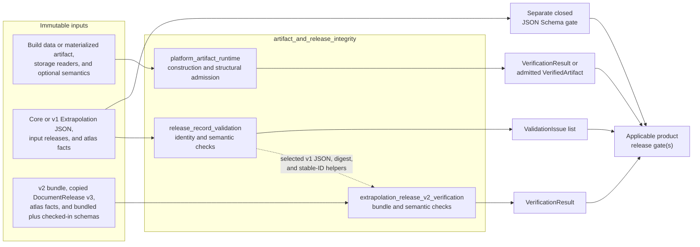
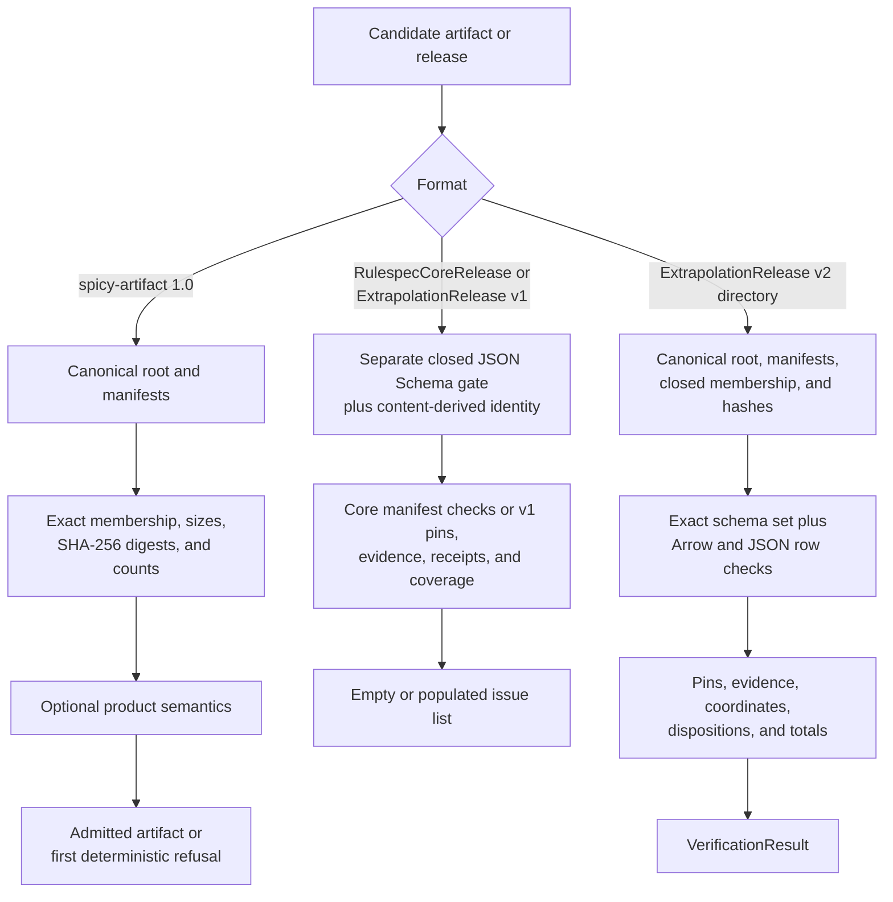

# Artifact and release integrity

## Purpose

`artifact_and_release_integrity` groups three complementary integrity components. Together, they construct and admit immutable platform artifacts, validate content-addressed Core and version 1 Extrapolation records, and verify partitioned version 2 Extrapolation bundles against pinned inputs, schemas, evidence, and totals.

Each component targets a distinct format family and integrity layer. Apply every gate relevant to that format. A successful check does not approve, publish, deploy, or activate a release.

## Architecture

The verification path depends on the candidate format:

## Core component documentation

| Component | Implementation | Responsibility |
| --- | --- | --- |
| [Platform artifact runtime](platform_artifact_runtime.md) | `packages/rulespec-artifacts/src/rulespec_artifacts/_artifact.py` | Builds canonical roots and manifests, verifies exact structure and bytes, and supports race-resistant reads and durable no-replace publication. `verify_artifact()` returns `VerificationResult`; `admit_artifact()` returns `VerifiedArtifact` or raises `ArtifactVerificationError`. |
| [Release record validation](release_record_validation.md) | `tools/rulespec_release.py` | Validates `RulespecCoreRelease` and single-JSON `ExtrapolationRelease` v1 identities and semantics. It returns `list[ValidationIssue]`; callers must also apply the closed JSON Schema. |
| [Extrapolation release v2 verification](extrapolation_release_v2_verification.md) | `tools/extrapolation_release_v2.py` | Verifies partitioned v2 roots, manifests, schemas, Parquet rows, pins, evidence, dispositions, and rollups. It returns `VerificationResult` with ordered issues and a stable primary code. |

The version 2 verifier reuses strict version 1 JSON loading, canonical bytes and digests, digest syntax, and stable record IDs from `rulespec_release.py`. It separately validates embedded version 1 evidence records against their registered schemas. The platform artifact runtime remains a separate, product-neutral format and runtime.