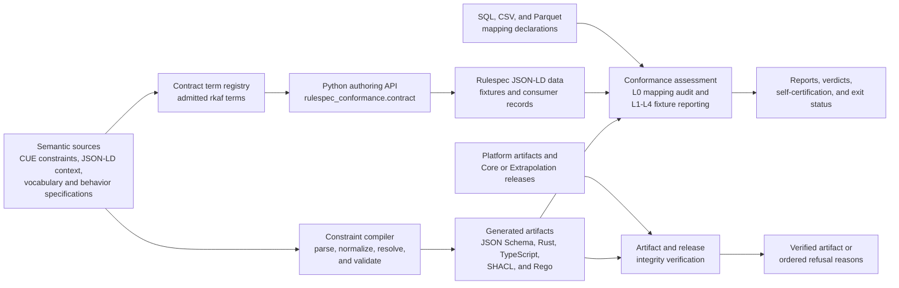
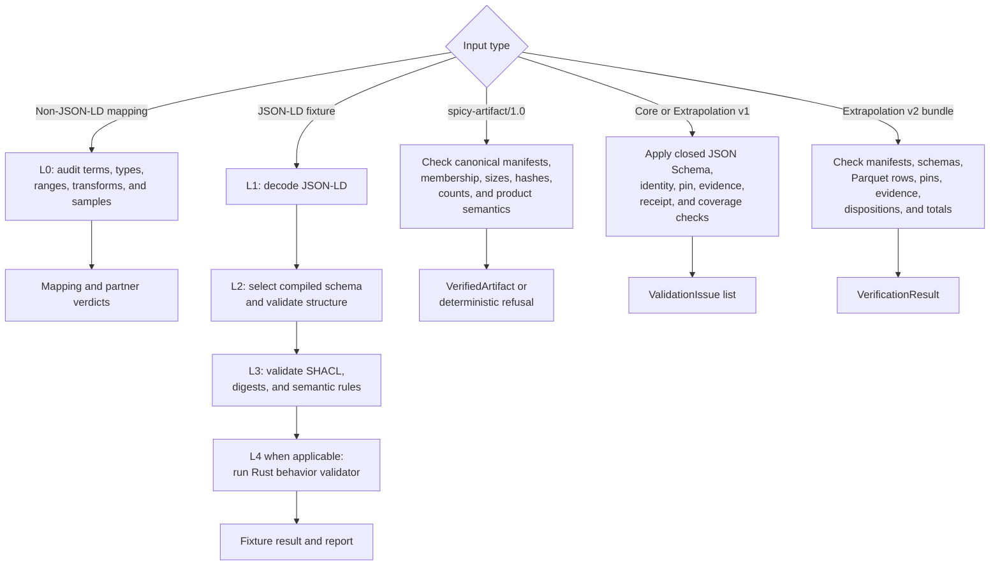

# Rulespec repository overview

## Purpose

Rulespec makes rules legible to software. It defines a machine-validatable record of a rule’s origin, authority, lifecycle, adoption, usage permissions, concepts, and supporting evidence.

The repository provides three connected capabilities:

1. Compile authoritative CUE constraints into schemas, types, validation shapes, and policy artifacts.
2. Assess implementations and fixtures through L0–L4 conformance checks.
3. Verify immutable platform artifacts and release records before consumers admit them.

Rulespec supplies the semantic and validation foundation beneath rule-driven products; it is not a workflow engine, document processor, search engine, or publication system.

## End-to-end architecture

Compilation and validation remain separate responsibilities. The term registry helps Python producers use admitted names, but it does not define their meaning or validate data. Compiled JSON Schema, SHACL, and runtime behavior implement those checks.

### Assessment and integrity paths

These checks produce evidence for a release decision. Passing them does not publish, deploy, or activate an artifact.

## Core module documentation

### Semantic compilation and binding

- [Semantic contract compilation and binding](/Users/mikewolfd/Work/rulespec/wiki/semantic_contract_compilation_and_binding.md)
- [Constraint compiler AST](/Users/mikewolfd/Work/rulespec/wiki/constraint_compiler_ast.md) — parses the supported CUE subset, resolves composed shapes, and emits target formats.
- [Contract term registry](/Users/mikewolfd/Work/rulespec/wiki/contract_term_registry.md) — exposes admitted `rkaf:` terms through the Python package.

### Conformance assessment and certification

- [Conformance assessment and certification](/Users/mikewolfd/Work/rulespec/wiki/conformance_assessment_and_certification.md)
- [Compiled schema binding](/Users/mikewolfd/Work/rulespec/wiki/compiled_schema_binding.md) — discovers schemas and selects immutable bindings for L2 validation.
- [Conformance fixture reporting](/Users/mikewolfd/Work/rulespec/wiki/conformance_fixture_reporting.md) — runs L1–L4 checks and renders reports or reference self-certification.
- [L0 mapping audit](/Users/mikewolfd/Work/rulespec/wiki/l0_mapping_audit.md) — audits non-JSON-LD mappings against the vocabulary.

### Artifact and release integrity

- [Artifact and release integrity](/Users/mikewolfd/Work/rulespec/wiki/artifact_and_release_integrity.md)
- [Platform artifact runtime](/Users/mikewolfd/Work/rulespec/wiki/platform_artifact_runtime.md) — constructs and verifies canonical `spicy-artifact/1.0` artifacts.
- [Release record validation](/Users/mikewolfd/Work/rulespec/wiki/release_record_validation.md) — validates Core and Extrapolation version 1 release records.
- [Extrapolation release v2 verification](/Users/mikewolfd/Work/rulespec/wiki/extrapolation_release_v2_verification.md) — verifies partitioned version 2 bundles and their evidence.