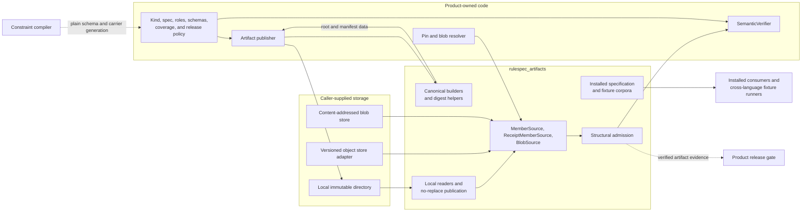
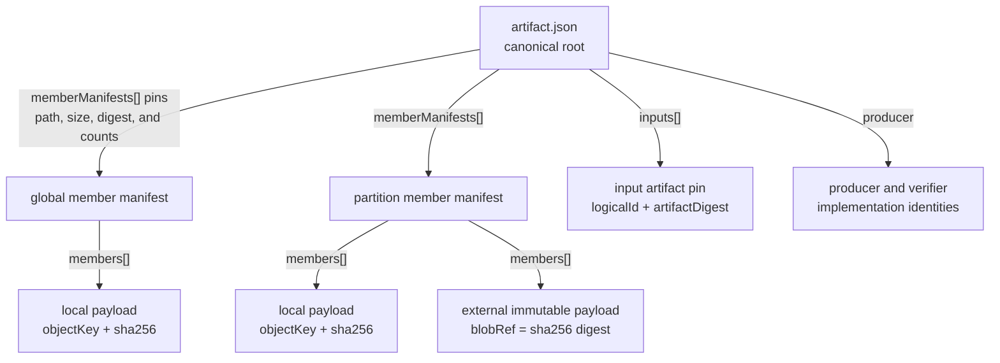
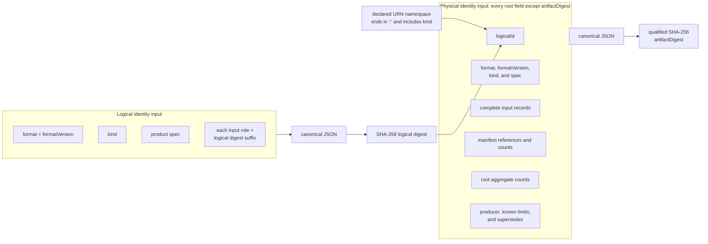
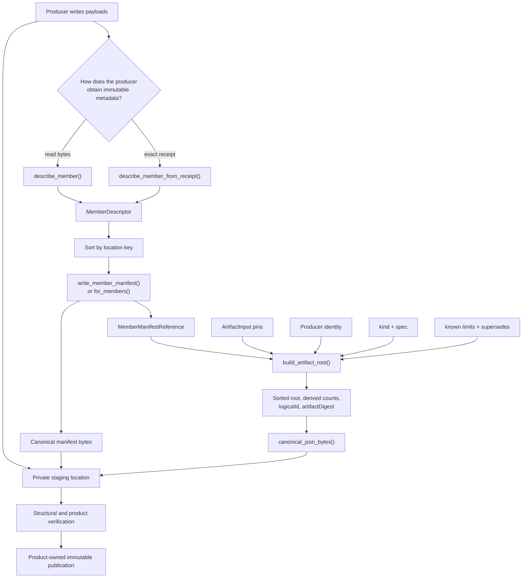
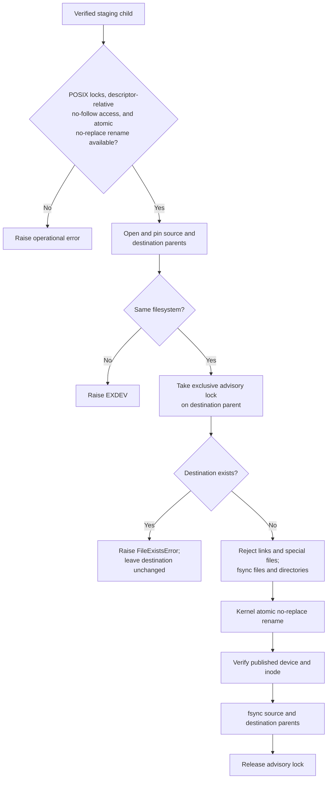

# Platform artifact runtime

The `platform_artifact_runtime` module is Rulespec's product-neutral runtime for building, identifying, verifying, and safely publishing immutable platform artifacts. It defines the shared byte format and refuses an artifact unless its root, manifests, declared membership, payload digests, counts, and optional external pin agree.

The implementation lives in the standalone [`rulespec_artifacts` package](../packages/rulespec-artifacts/src/rulespec_artifacts/_artifact.py). Products inject storage access and semantic checks through small Python protocols. The runtime has no knowledge of catalogs, documents, regulations, search indexes, or graph meaning. The [Rulespec platform-artifact specification](../spec/platform-artifacts.md) defines the normative format; this page explains the code, its place in the larger system, and how to change it safely.

## At a glance

| Question | Answer |
| --- | --- |
| What goes in? | Product-owned `kind` and `spec` data, exact input pins, payload descriptors, sealed member manifests, and a `MemberSource`. Admission can also receive a `BlobSource`, an expected `ArtifactPin`, a `SemanticVerifier`, and custom lower resource limits. |
| What happens? | Builders produce canonical JSON, aggregate counts, and logical and physical identities. Admission validates canonical bytes, closed common records, identities, manifests, exact local membership, paths, sizes, SHA-256 digests, counts, and then optional product semantics. |
| What comes out? | Builders return manifest references and a stamped root mapping. `admit_artifact()` returns `VerifiedArtifact` or raises. `verify_artifact()` returns `VerificationResult` with either the artifact or one deterministic `VerificationIssue`. |
| How is it checked? | Focused package tests cover canonicalization, identity, manifests, receipts, blobs, filesystem races, publication, relations, and admitted-row parsing. Shared fixture corpora and isolated-wheel tests check byte compatibility, diagnostics, resources, unknown product kinds, and the package's empty dependency closure. |

## Responsibilities and system boundary

The runtime owns behavior that every product must apply in exactly the same way:

- canonical JSON encoding and byte-exact root and manifest parsing;
- logical and physical artifact identity;
- root and member-manifest construction;
- portable object-key validation;
- exact local membership and external blob verification;
- bounded root, manifest, and payload reads;
- aggregate manifest, member, byte, and record counts;
- common diagnostic codes;
- provider-neutral storage interfaces;
- race-resistant local reads and file-state capture;
- same-filesystem, durable, no-replace local publication;
- canonical set, framed section, and schema-family digest helpers; and
- optional shared rules for derivation and composition relations.

Product code remains responsible for:

- the root `kind` and the closed meaning of its `spec` object;
- accepted producer and verifier identities;
- required input roles, member roles, media types, and payload schemas;
- completeness, coverage, evidence, and other domain rules;
- resolving artifact pins and blob digests to storage;
- authorization, credentials, retries, and immutable version selection;
- mutable current pointers and succession policy; and
- release approval, publication, deployment, and activation.

Structural admission proves that the supplied bytes form one internally consistent platform artifact. It does not certify product meaning or validate a release record. See [Release record validation](release_record_validation.md) and [Extrapolation release v2 verification](extrapolation_release_v2_verification.md) for the adjacent integrity layers.

## Architecture and dependencies

`rulespec_artifacts` keeps common byte and verification rules in a small library. Product-owned adapters connect it to storage, and product-owned semantic verifiers apply domain rules only after structural admission.



The runtime itself uses Python's standard library. It opportunistically uses `msgspec` for byte-identical JSON string encoding when a consumer environment already provides it; the package does not declare `msgspec` or any other runtime dependency. SQLite supplies a temporary exact-membership index inside the process. It is not a product database.

The generated platform JSON Schema, Rust, and TypeScript types are plain data carriers. They can represent the root shape, but they do not canonicalize bytes, derive identity, prove membership, or hash payloads. [Constraint compiler AST](constraint_compiler_ast.md#target-behavior) documents that generation path. [Compiled schema binding](compiled_schema_binding.md#discovery-inputs) explains why platform schemas do not participate in JSON-LD Level 2 dispatch.

The two release-record validators remain sibling checks rather than imports of this runtime. They validate different roots and product evidence; neither release-record success nor platform-artifact admission substitutes for the other.

### Package surface

| File | Role |
| --- | --- |
| [`rulespec_artifacts/_artifact.py`](../packages/rulespec-artifacts/src/rulespec_artifacts/_artifact.py) | Canonical bytes, data records, storage protocols, construction, admission, local adapters, and publication. |
| [`rulespec_artifacts/__init__.py`](../packages/rulespec-artifacts/src/rulespec_artifacts/__init__.py) | Public re-exports and package version. |
| [`rulespec_artifacts/resources.py`](../packages/rulespec-artifacts/src/rulespec_artifacts/resources.py) | Access to the installed specification, structural fixtures, canonical JSON corpus, and named fixture directories. |
| [`tools/platform_artifact.py`](../tools/platform_artifact.py) | Source-checkout compatibility shim. Reusable code should import `rulespec_artifacts` directly. |
| [`packages/rulespec-artifacts/pyproject.toml`](../packages/rulespec-artifacts/pyproject.toml) | Standalone wheel metadata and package-data inclusion. |

The full `rulespec-conformance` distribution depends on this smaller package instead of copying its implementation. An artifact-only consumer can install `rulespec-artifacts` without the RDF, JSON-LD, or Shapes Constraint Language (SHACL) stack used by conformance reporting.

## Artifact structure

One artifact occupies a closed directory or object-store prefix. `artifact.json` names every member manifest. Each manifest names every payload in its scope. A payload either lives inside the artifact under an `objectKey` or outside it under a content digest in `blobRef`.



### Root

The root uses format `spicy-artifact` and exact format version `1.0`. It has these required fields:

| Field | Meaning |
| --- | --- |
| `format`, `formatVersion` | Select the exact common format. |
| `kind` | Product-owned lowercase kebab-case artifact kind. |
| `spec` | Product-owned canonical JSON object. The common runtime checks only that it is an object. |
| `logicalId` | Namespace plus a digest of logical state. |
| `artifactDigest` | Qualified SHA-256 digest of the complete physical root, excluding only itself. |
| `inputs` | Sorted exact upstream artifact pins with product-owned roles. |
| `producer` | Immutable publisher and semantic-verifier identities. |
| `memberManifests` | Sorted references to all subordinate manifests. |
| `counts` | Exact totals derived from those manifests. |

The only optional root fields are `knownLimits` and `supersedes`. Unknown common fields fail admission. Optional fields are absent when unused; callers should not write null or empty placeholders.

Format 1.0 limits `artifact.json` to 1 MiB and each member manifest to 64 MiB. The public APIs expose limits so callers can enforce smaller operational ceilings. A format 1.0 reader must not use larger values to weaken the normative bounds.

### Manifests and members

A `MemberManifestReference` pins a manifest by scope, normalized path, byte size, SHA-256 digest, and aggregate counts. The referenced manifest repeats its identity and counts around a canonical, streamed `members` array.

A `MemberDescriptor` uses exactly one location form:

- A local member declares `objectKey` and `sha256`.
- An external member declares `blobRef`, whose value is the qualified SHA-256 digest of the external bytes.

Both forms also declare `role`, `mediaType`, and `byteSize`. `recordCount` and `schemaId` are optional. `blobRef` is a content identity, never a URL or mutable locator.

The common runtime checks `mediaType` only as nonempty ASCII and `schemaId` only as an absolute identifier. A product verifier must parse media-type parameters, resolve schemas, validate records, and enforce role-specific field presence when those rules matter.

### Ordering, uniqueness, and closure

The format sorts strings by unsigned UTF-16 code units. Python's default Unicode order is not the format authority.

| Collection | Required order and uniqueness |
| --- | --- |
| Root `inputs` | Sorted and distinct by `(role, logical digest suffix)`. |
| Root `memberManifests` | Sorted and distinct by `(scopeKind, scopeId, objectKey)`. |
| Root `knownLimits` | Nonempty when present; sorted and distinct by `(scope, code)`. |
| `KnownLimit.evidenceDigests` | Nonempty, sorted, and distinct. Every digest resolves to an input artifact or payload member. |
| Manifest `members` | Sorted and distinct by `(location kind, location value)`, where the kind is `object-key` or `blob-ref`. Locations remain unique across all manifests. |
| `DerivationRelation.expectedOutputRoles` | Nonempty, sorted, and distinct. |
| `CompositionRelation.totalOrderKey` | Nonempty and distinct. Its declared semantic order is preserved. |

Protocol files and payloads share one local namespace. `artifact.json`, each manifest path, and each local payload path must be unique. `MemberSource.keys()` must enumerate the complete local file set so admission can reject both missing and extra members. External blobs sit outside that local membership set.

## Core component model

```mermaid
classDiagram
    class ArtifactPin
    class ArtifactInput
    class Producer
    class KnownLimit
    class Supersedes
    class MemberManifestReference
    class MemberDescriptor
    class VerifiedArtifact
    class VerificationResult
    class VerificationIssue

    class MemberSource {
        <<Protocol>>
        +keys()
        +open(object_key)
    }
    class ReceiptMemberSource {
        <<Protocol>>
        +receipt(object_key)
    }
    class BlobSource {
        <<Protocol>>
        +open(blob_ref)
    }
    class SemanticVerifier {
        <<Protocol>>
        +__call__(artifact, source)
    }

    class LocalMemberSource
    class LocalBlobSource
    class PinnedLocalDirectory
    class LocalFileState
    class LocalFileStateIndex

    ArtifactPin --> VerifiedArtifact : exact identity
    ArtifactInput --> VerifiedArtifact : admitted inputs
    MemberManifestReference --> VerifiedArtifact : sealed manifests
    MemberDescriptor --> MemberManifestReference : declared by
    VerificationIssue --> VerificationResult : refusal
    VerifiedArtifact --> VerificationResult : success
    ReceiptMemberSource --|> MemberSource
    LocalMemberSource ..|> MemberSource
    LocalBlobSource ..|> BlobSource
    PinnedLocalDirectory --> LocalMemberSource : creates
    PinnedLocalDirectory --> LocalBlobSource : creates
    LocalFileState --> LocalFileStateIndex : stored in
    LocalFileStateIndex --> VerifiedArtifact : exposed by
    SemanticVerifier --> VerifiedArtifact : checks after admission
```



### Identity, provenance, and lifecycle records

| Component | Responsibility | Important behavior |
| --- | --- | --- |
| `ArtifactPin` | Identifies one declared logical artifact and exact materialization. | Pass it as `expected_pin` to refuse a different root before product checks run. |
| `ArtifactInput` | Binds one product-owned input role to exact upstream bytes. | `logicalId` must be absolute and end in a 64-character digest; `artifactDigest` must be a qualified lowercase SHA-256 digest. |
| `Producer` | Records immutable publisher and semantic-verifier identities. | Both implementation IDs must contain a published SHA-256 digest or full Git object ID. Structure checks syntax; product policy decides trust. |
| `KnownLimit` | Attaches an artifact-specific limitation to exact evidence. | Its evidence must resolve to an admitted input digest or member digest. It changes physical identity, not logical identity. |
| `Supersedes` | Names an exact predecessor and explains the replacement. | The runtime validates its closed shape. Product pointer logic must resolve the predecessor and prove series continuity. |

### Membership and digest records

| Component | Responsibility | Important behavior |
| --- | --- | --- |
| `MemberDescriptor` | Describes one payload's location, role, media type, byte size, and optional record count and schema ID. | It accepts either the local `objectKey`/`sha256` pair or an external `blobRef`, never both or neither. |
| `MemberManifestReference` | Pins one bounded manifest and repeats its accounting in the root. | `for_members()` sorts a finite sequence and returns reference plus bytes. `write_member_manifest()` accepts an already sorted iterable and streams it. |
| `FramedSection` | Names one counted record iterable for `framed_section_digest()`. | Framing includes section names, declared counts, and record lengths without materializing a corpus array. |

`describe_member()` opens and hashes a producer-written local payload. `describe_member_from_receipt()` validates immutable metadata supplied by a producer or provider without reading bytes; it does not contact storage or prove the receipt's origin. Admission checks the resulting descriptor again through the injected source.

### Storage interfaces and local adapters

| Component | Responsibility | Important behavior |
| --- | --- | --- |
| `MemberSource` | Lists and opens artifact-local files without selecting a provider. | `keys()` defines exact local membership. `open()` returns a binary context manager. |
| `ReceiptMemberSource` | Adds provider-issued immutable metadata for local payloads. | `receipt()` can avoid a payload download, but never replaces byte reads for the root or manifests. |
| `ImmutableMemberReceipt` | Holds the exact object key, byte size, SHA-256 checksum, and immutable provider version ID. | The version must be nonempty, non-null, and free of whitespace. |
| `BlobSource` | Opens external content by qualified digest. | Admission always streams and hashes external blobs. |
| `LocalMemberSource` | Reads a local artifact tree without following links. | It pins directory identity, uses descriptor-relative opens, rejects links and special files, and checks file state across the read. |
| `LocalBlobSource` | Maps `sha256:<hex>` to `sha256/<hex>` under a pinned local root. | It verifies the content address on every open before yielding the checked stream. |
| `PinnedLocalDirectory` | Pins a real directory and creates contained artifact or blob readers. | It can also move or durably publish one named child with no replacement. |
| `LocalFileState` | Captures device, inode, size, timestamps, and mode during payload hashing. | Consumers can compare the observed file identity before a later local read. |
| `LocalFileStateIndex` | Exposes local file states from the temporary SQLite index. | It avoids one Python object per member. Consumers should call `close()` when finished. |

`MemberNotFoundError` reports deterministic absence. Admission converts it to `invalid.membership-missing`. `MemberSourceError` reports an operational storage failure and normally propagates, preventing an outage from being mislabeled as invalid content.

### Verification and extension records

| Component | Responsibility | Important behavior |
| --- | --- | --- |
| `VerifiedArtifact` | Exposes the verified root, pin, inputs, manifests, totals, and optional local file states. | The dataclass is frozen, but its nested root mapping is not recursively immutable. Treat it as read-only. |
| `SemanticVerifier` | Applies product rules after common structural admission. | It receives the verified artifact and the same source. Use `iter_member_descriptors()` rather than implementing another manifest parser. |
| `VerificationIssue` | Records one deterministic failure with `code`, `path`, and `message`. | Its string form is stable and suitable for logs. |
| `VerificationResult` | Represents result-style verification. | Success contains an artifact and no issues. Refusal contains no artifact and the first issue; `code` returns `valid` or that issue code. |

`verify_artifact()` catches `ArtifactVerificationError` from structural or semantic verification and returns a `VerificationResult`. `admit_artifact()` performs the same work but raises that deterministic error. Operational source errors, other product-verifier exceptions, and programming errors propagate from both functions.

Shared admission validates `ArtifactInput` records but does not resolve or open the upstream artifacts they name. The product's semantic verifier or outer release gate owns that exact-input admission step.

### Optional relation records

| Component | Responsibility | Shared check |
| --- | --- | --- |
| `DerivationRelation` | Binds processor, policy, parameters, partitioning, and expected output-role identities. | `validate_derivation_relation()` requires at least one input, at least one output member, and an exact set match between observed and expected roles. |
| `CompositionRelation` | Binds merge-policy identity and a declared total-order key for a reference-only composition. | `validate_composition_relation()` requires at least one input and requires every input role to be `member`. |

These helpers do not dispatch on root `kind` and do not reserve `derivation` or `composition` as kinds. In particular, the composition helper does not enforce the reference-only payload rule or interpret `totalOrderKey`. A product explicitly invokes the applicable helper from its semantic verifier and still checks placement, input compatibility, output meaning, ordering, coverage, and domain-specific evidence.

## Canonical JSON and identity

The canonical JSON layer admits null, booleans, valid Unicode strings, arrays, objects with string keys, and integers from `-(2^53 - 1)` through `2^53 - 1`. `canonical_json_bytes()` rejects binary floats, out-of-range integers, lone Unicode surrogates, non-text object keys, and unsupported Python values. `parse_canonical_json()` also rejects invalid UTF-8, a byte order mark, duplicate keys, non-finite constants, and every raw spelling that differs from the canonical encoding.

`canonical_json_bytes()` recursively encodes the admitted value domain and sorts object keys by UTF-16 code units. The implementation maintains bounded least-recently-used caches for encoded strings and sort keys, each capped at 65,536 entries. If `msgspec` is importable, the string encoder uses `msgspec.json.encode()`; otherwise it uses `json.dumps()`. Tests pin fallback behavior and, when `msgspec` is available, require identical bytes and lone-surrogate refusals from both paths. The accelerator must never alter an identity or refusal boundary.

### Choosing a parser

| Function | Use it for | What it proves |
| --- | --- | --- |
| `parse_canonical_json()` | `artifact.json`, manifests, digest-bearing fixtures, and any bytes not already protected by an artifact build gate. | The bytes are unambiguous admitted JSON and exactly match the canonical encoding. |
| `parse_admitted_json()` | Individual JSON rows read from a payload whose bytes were already admitted and whose producer gate established canonical row encoding. | The row is syntactically valid UTF-8 JSON with no byte order mark, duplicate keys, floats, or non-finite constants. It intentionally skips re-encoding and therefore does not enforce canonical spelling, the JSON-safe integer range, or the lone-surrogate check on decoded strings. |

`parse_admitted_json()` is a narrow performance API. For example, it accepts insignificant whitespace, unsorted keys, alternate escapes, integers outside `±(2^53 - 1)`, and a lone surrogate written as a JSON escape. A matching member digest pins bytes but does not, by itself, prove each embedded row belongs to the canonical value domain or uses canonical spelling. Product build verification must establish both invariants before consumers use the faster parser. Never use it for a root, manifest, unadmitted file, or input whose canonical form remains unproved.

### Logical and physical identity



The two identities answer different questions:

- `logicalId` identifies product-defined logical state. Its digest includes the format, exact format version, `kind`, `spec`, and each input's role and logical digest suffix. It excludes packaging, exact upstream materializations, producer evidence, known limits, succession evidence, manifests, and payload layout.
- `artifactDigest` identifies one exact materialization and its publication evidence. It hashes the complete root after removing only `artifactDigest`.

The logical ID namespace must be an absolute URN ending in `:` and containing the kind. The namespace does not enter the logical digest. `build_artifact_root()` defaults to `urn:spicy:artifact:<kind>:`; a caller can supply another valid namespace.

A namespace-only change therefore preserves the 64-character logical digest suffix but changes the complete `logicalId` string. Because the physical root contains that string, the change also produces a different `artifactDigest`.

### Digest helpers

| Function or type | Purpose |
| --- | --- |
| `sha256_digest()` | Hash bytes directly or hash a value after canonical encoding; return `sha256:<hex>`. |
| `CanonicalSetDigester` | Stream a sorted, duplicate-free text set as the digest of one canonical JSON array. |
| `framed_section_digest()` and `FramedSection` | Hash ordered, counted record sections with explicit binary framing and no corpus-sized array. |
| `schema_bundle_digest()` | Hash a closed JSON Schema family after removing only top-level `$id` values and rewriting contained relative `$ref` values into one `$defs` object. |
| `expected_logical_digest()` and `expected_logical_id()` | Recompute logical identity from a root. |
| `expected_artifact_digest()` | Recompute physical identity without self-reference. |
| `stamp_root()` | Copy a root, remove stale identities, derive both identities, and validate the result. |

`schema_bundle_digest()` rejects absolute references, non-JSON-Pointer fragments, escaped or missing target schemas, uncontained paths, empty bundles, and non-object schemas. Products should call it instead of defining a second schema-family preimage.

## Construction data flow

Product publishers create payload meaning. The runtime creates portable descriptors, canonical manifests, aggregate accounting, ordering, and identities.



The normal producer sequence is:

1. Write payloads into a private staging location or obtain exact immutable provider receipts.
2. Create one `MemberDescriptor` for every payload.
3. Sort descriptors by location and seal each scope with `write_member_manifest()`. The writer spools descriptor bytes to disk after 1 MiB by default, computes totals in one pass, and returns a `MemberManifestReference`.
4. Pass all sealed references to `build_artifact_root()`. The builder sorts inputs, manifests, and known limits, derives root counts, stamps both identities, and validates the result.
5. Encode the returned mapping with `canonical_json_bytes()` and write it as `artifact.json`.
6. Run `admit_artifact()` with the product's `SemanticVerifier` against the complete staging artifact.
7. Publish through the product's approved immutable storage operation. For a same-filesystem local tree, use `publish_directory_no_replace()`.

`build_artifact_root()` returns a mapping; it writes and publishes nothing. `MemberManifestReference.for_members()` is convenient for a bounded in-memory sequence because it returns both the reference and manifest bytes. Large or one-pass producers should call `write_member_manifest()` with an already sorted iterator and destination stream.

### Minimal local construction

```python
from pathlib import Path

from rulespec_artifacts import (
    ROOT_OBJECT_KEY,
    LocalMemberSource,
    MemberManifestReference,
    Producer,
    build_artifact_root,
    canonical_json_bytes,
    describe_member,
)

staging = Path("build/example-artifact")
payload = staging / "records/items.jsonl"
payload.parent.mkdir(parents=True, exist_ok=True)
payload.write_bytes(b'{"id":"one"}\n')

source = LocalMemberSource(staging)
member = describe_member(
    source,
    object_key="records/items.jsonl",
    role="records",
    media_type="application/jsonl",
    record_count=1,
)
manifest, manifest_bytes = MemberManifestReference.for_members(
    scope_kind="global",
    scope_id="all",
    object_key="manifests/all.json",
    members=(member,),
)

manifest_path = staging / manifest.object_key
manifest_path.parent.mkdir(parents=True, exist_ok=True)
manifest_path.write_bytes(manifest_bytes)

root = build_artifact_root(
    kind="example-index",
    spec={"schemaDigest": "sha256:" + "3" * 64},
    producer=Producer(
        product="example",
        implementation_id="git:https://example.test/example@" + "1" * 40,
        verifier_id="urn:example:artifact-verifier",
        verifier_version="1.0.0",
        verifier_implementation_id=(
            "pkg:pypi/example-verifier@1.0.0?checksum=sha256:" + "2" * 64
        ),
    ),
    manifests=(manifest,),
)
(staging / ROOT_OBJECT_KEY).write_bytes(canonical_json_bytes(root))
```

This example assembles bytes only. A production publisher must also run its semantic verifier, use accepted immutable implementation identities, keep staging private until all checks pass, and publish through its approved storage boundary.

## Admission and component interaction

Both public admission functions call the same internal `_admit()` pipeline. The verifier stops at the first deterministic issue so product code never receives partially admitted data.

```mermaid
sequenceDiagram
    participant Caller
    participant API as verify_artifact or admit_artifact
    participant Source as MemberSource
    participant Index as Temporary SQLite index
    participant Blob as BlobSource
    participant Semantic as SemanticVerifier

    Caller->>API: source, optional blob source, pin, limits, semantic verifier
    API->>Source: open artifact.json
    Source-->>API: bounded root bytes
    API->>API: parse canonical JSON, validate shape, derive identities
    API->>Index: register artifact.json and manifest paths

    loop Each manifest reference
        API->>Source: open manifest
        Source-->>API: streamed canonical members array
        API->>Index: register each local or blob descriptor
        API->>API: verify framing, size, digest, order, and counts
    end

    API->>Source: keys()
    Source-->>API: complete artifact-local file set
    API->>Index: mark observations; find missing or extra keys

    loop Each payload descriptor
        alt ReceiptMemberSource local payload
            API->>Source: receipt(objectKey)
            Source-->>API: exact key, version, size, and SHA-256
        else Ordinary local payload
            API->>Source: open(objectKey)
            Source-->>API: streamed bytes
        else External blob
            API->>Blob: open(blobRef)
            Blob-->>API: streamed bytes
        end
        API->>API: compare size and digest
    end

    API->>API: compare root aggregate counts
    opt Semantic verifier supplied
        API->>Semantic: VerifiedArtifact and same source
        Semantic-->>API: product verdict
    end
    API-->>Caller: artifact, result refusal, or raised refusal
```

### Admission stages

1. Read `artifact.json` within the root limit.
2. Require canonical JSON, the exact format/version, closed common fields, and valid shared records.
3. Recompute `logicalId` and `artifactDigest`, then compare an optional external `ArtifactPin`.
4. Create a temporary SQLite index for protocol paths and streamed member descriptors. `scratch_directory` can place that database on caller-selected storage.
5. Stream each manifest and check framing, canonical entries, location order, uniqueness, size, SHA-256, and accounting.
6. Resolve each known-limit evidence digest to an exact input or payload.
7. Enumerate `MemberSource.keys()` once. Reject the first missing local path or lexically smallest extra path.
8. Check every payload. Use exact immutable receipt metadata only for a local member when the source implements `ReceiptMemberSource`; otherwise stream and hash the bytes. Always stream and hash an external blob.
9. Recompute root aggregate counts from the admitted manifests.
10. Return `VerifiedArtifact`. For `LocalMemberSource`, transfer the SQLite connection into `LocalFileStateIndex` so file states remain disk-backed.
11. Invoke `SemanticVerifier` only after every shared check passes.

Provider receipts can replace only the local payload download used to compare size and SHA-256. The root and manifests always pass through byte verification. Because the artifact format does not store provider version IDs, an adapter must bind receipts, later opens, and product reads to the same immutable provider version.

Use `admit_artifact()` when deterministic invalidity should raise `ArtifactVerificationError`. Use `verify_artifact()` at reporting or service boundaries that need a stable result value. When a local admission succeeds, explicitly close `artifact.local_member_states` if it is a `LocalFileStateIndex`.

## Local filesystem safety and publication

The local adapter treats path strings as untrusted lookup hints. `PinnedLocalDirectory` and `LocalMemberSource` derive directory identity from open file descriptors, reopen pinned directories by device and inode, and traverse child names with descriptor-relative, no-follow operations. `keys()` rejects symbolic links and special files. `open()` compares file state before reading, after reading, and after reopening the same key.

This design detects path replacement and mutation during a read. It is not an authorization boundary against a hostile process that already has permission to rewrite the complete tree. Deployments isolate mutually untrusted writers with operating-system accounts, filesystem permissions, or storage credentials.

`LocalMemberSource` does not lock payload files, and its continuity check covers one `open()` call. It does not automatically compare a later semantic read with the `LocalFileState` captured during structural admission. Keep staging immutable across both passes or make the product verifier compare its later observation with `local_member_states` before it trusts the content.



`publish_directory_no_replace()` supports macOS through `renameatx_np` and Linux through `renameat2`. Unsupported hosts fail closed. Source and destination must share a filesystem, and publication never overwrites an existing destination.

Lower-level functions serve callers that already hold pinned directory descriptors:

- `publish_child_directory_no_replace()` performs tree synchronization, advisory locking, the conditional rename, identity verification, and parent synchronization.
- `move_child_directory_no_replace()` performs only the atomic no-replace move and identity check, which suits transaction cleanup where the caller does not need a durability pass.
- The matching `PinnedLocalDirectory` methods reopen and verify pinned parents before invoking those operations.

The advisory lock coordinates cooperating writers. The kernel's no-replace rename remains the final authority.

## Product semantic verification

`SemanticVerifier` keeps product meaning outside the shared reader. It can inspect `artifact.root["spec"]`, producer identity, inputs, roles, schemas, coverage receipts, and member contents. It should not repeat canonicalization, membership, path, size, or digest checks.

`iter_member_descriptors()` re-streams descriptors from the verified manifests for semantic checks. The second pass rechecks manifest framing, bytes, order, and counts, so product code receives the same interpretation used by structural admission.

A semantic verifier should fail closed on an unknown `kind` or unsupported product `spec`. The common runtime deliberately admits a structurally valid unknown kind; isolated-wheel tests pin this product-neutral behavior.

## Failure model

Structural validation uses a closed diagnostic vocabulary. `_fail()` rejects undeclared common codes, preventing accidental diagnostic drift.

| Code | Refusal category |
| --- | --- |
| `invalid.root-syntax` | Root bytes are invalid JSON, noncanonical, outside the admitted value domain, or otherwise syntactically invalid. |
| `invalid.format` | `format` or the exact `formatVersion` is unsupported. |
| `invalid.identity` | Logical identity, physical identity, or an external pin differs. |
| `invalid.path` | A key violates portable relative-path rules, a traversal encounters a link or non-directory, a tree contains a special file, or an initial local path is not a real contained directory. A pinned directory that changes later is an operational source error. |
| `invalid.manifest` | Manifest framing, entries, ordering, uniqueness, size, digest, or reference agreement fails. |
| `invalid.membership-missing` | A declared root, manifest, local payload, or required blob is absent. |
| `invalid.membership-extra` | The artifact-local source enumerates an undeclared file. |
| `invalid.member-digest` | A payload receipt, byte size, SHA-256 digest, content address, or stable local file state differs. |
| `invalid.schema` | A closed common record has missing, unknown, malformed, unordered, duplicate, or inconsistent fields. Shared relation failures also use this code. |
| `invalid.statistics` | Manifest or root totals differ from observed membership. |
| `invalid.limit` | A root or manifest exceeds the active bounded-read limit. |

The runtime separates invalid content from unavailable storage:

- `ArtifactVerificationError` carries a deterministic `VerificationIssue`. `verify_artifact()` converts this error to a result whether structural or semantic verification raised it.
- `MemberNotFoundError` is a source signal that admission normalizes to missing membership.
- `MemberSourceError`, other `OSError` values, lock contention, unsupported host operations, unexpected product-verifier exceptions, and programming errors propagate.
- `FileExistsError` during publication means the immutable destination already exists and remains unchanged.

The verifier reports one issue because it stops at the first failure. Consumers should branch on `issue.code`; `path` and `message` provide evidence for logs and people.

## Performance and resource behavior

The runtime bounds memory by file limits, streaming, caches, and a disk-backed index:

- It reads the root into memory only within `root_byte_limit`.
- `_CanonicalArrayStream` yields one manifest descriptor at a time.
- Manifest construction spills descriptor bytes to disk after `spool_bytes`.
- Payloads and blobs hash in 1 MiB chunks.
- Exact membership, descriptors, observations, and local file states live in temporary SQLite.
- `CanonicalSetDigester` and `framed_section_digest()` accept ordered streams.
- String encodings and UTF-16 sort keys use separate 65,536-entry least-recently-used caches instead of growing with record count.
- `parse_admitted_json()` avoids a redundant canonical re-encode for already admitted, build-verified payload rows.

Verification still performs work proportional to member count and total payload bytes unless exact provider receipts avoid local payload downloads. Semantic checks can add another manifest or payload pass. Callers should provide enough scratch space for the exact-membership index and close a retained `LocalFileStateIndex`.

## Contribution guide

### Start with the owning layer

| Change | Primary owner | Required follow-through |
| --- | --- | --- |
| Canonical JSON, identity, membership, or common format rule | [`spec/platform-artifacts.md`](../spec/platform-artifacts.md) and `_artifact.py` | Decide format-version compatibility first. Update golden bytes, structural fixtures, package tests, and prior-encoder comparison evidence. |
| Root, manifest, or descriptor field | Normative specification and [`constraints/platform/platform-artifact.cue`](../constraints/platform/platform-artifact.cue) | Update closed-field sets and dataclasses, regenerate plain carriers, add positive and negative fixtures, and verify installed resources. |
| Product kind, role, payload schema, or completeness rule | Product repository and its `SemanticVerifier` | Keep `_artifact.py` free of product-name branches. |
| Storage provider | Consumer-owned `MemberSource`, optional `ReceiptMemberSource`, and optional `BlobSource` adapter | Test absence versus outages, exact versions, checksums, key closure, and downstream reads from the same immutable version. Keep provider SDKs outside this package. |
| Local path or publication behavior | Local adapters and publication functions in `_artifact.py` | Add race, replacement, link, special-file, lock, crash-retry, same-filesystem, and destination-preservation tests. |
| Shared relation behavior | Normative optional relation profile and explicit helper | Define the small common rule and keep remaining product checks in semantic verifiers. |
| Installed specifications or fixtures | `resources.py`, wheel force-includes, and fixture builders | Prove access from an isolated installed wheel, not only a checkout. |
| Canonical hot-path optimization | Encoder and parser helpers | Prove byte and refusal parity with and without optional accelerators; keep caches bounded. |

### Invariants to preserve

- The shared runtime stays provider-neutral and product-neutral.
- Canonical byte or refusal changes follow format-major change control.
- Roots and manifests remain closed, canonical, bounded, and exactly versioned.
- Builders sort identity-bearing collections and derive counts.
- Manifest reads and writes remain streaming for large member sets.
- Exact local membership uses `keys()` plus a disk-backed index.
- Provider receipt admission requires exact SHA-256, size, and immutable version identity; weaker stores use byte hashing.
- External `blobRef` values remain content digests, never storage locations.
- Deterministic absence becomes an artifact issue; transient storage failure remains operational.
- Local traversal never follows symbolic links, and publication never replaces a destination.
- Product semantics start only after structural admission and reuse the public descriptor iterator.
- `parse_admitted_json()` remains limited to payload bytes whose canonical row form was already established at the build gate.
- Every public name appears in `__all__` and in installed-wheel import or behavior tests where appropriate.

### Test map

| Changed behavior | Primary evidence |
| --- | --- |
| Canonical encoder, parser, UTF-16 order, caches, or optional `msgspec` path | [`test_artifact.py`](../packages/rulespec-artifacts/tests/test_artifact.py), [`test_parse_admitted_json.py`](../packages/rulespec-artifacts/tests/test_parse_admitted_json.py), and the canonical corpus runner |
| Root identity, closed fields, order, manifests, counts, receipts, blobs, relations | [`test_artifact.py`](../packages/rulespec-artifacts/tests/test_artifact.py) |
| Local traversal, races, file states, locks, and publication | [`test_artifact.py`](../packages/rulespec-artifacts/tests/test_artifact.py) on supported POSIX hosts |
| Repository compatibility shim and fixture freshness | [`tools/test_platform_artifact.py`](../tools/test_platform_artifact.py) and [`build_platform_artifact_fixtures.py`](../tools/build_platform_artifact_fixtures.py) |
| Wheel resources, dependency closure, unknown kind, and packaged corpora | `make test-package-artifacts` |
| Generated platform carriers | `make cue-vet`, `make compile`, `make test-rust`, and `make test-audits` |

Update the common fixture corpus when a structural verdict changes. Update canonical JSON golden bytes only under deliberate encoder change control. Do not calculate expected bytes solely with the candidate encoder; golden values must remain independent evidence.

### Local verification

Run from the repository root:

```bash
# Fast package-owned loop.
uv run --project packages/rulespec-artifacts \
  python -m unittest discover \
  -s packages/rulespec-artifacts/tests -p 'test_*.py'

# Repository wrapper and fixture freshness.
uv run --no-project --python 3.12 --with-requirements requirements.txt \
  python -m unittest tools.test_platform_artifact -v
python3 tools/build_platform_artifact_fixtures.py --check

# Build and install the artifact-only wheel, then verify its resources,
# dependency closure, corpora, and unknown-kind admission.
make test-package-artifacts
```

If platform CUE or generated carriers change, also run:

```bash
make cue-vet
make compile
make test-rust
make test-audits
```

If an encoder optimization may differ from an earlier package, compare installed wheels:

```bash
make test-artifact-encoder-compat \
  PREVIOUS_ARTIFACT_WHEEL=/absolute/path/to/previous.whl
```

Use `make test` before landing a high-impact common-format, package, or cross-language change. `make compile` can update tracked generated evidence, so review its complete diff and preserve unrelated worktree changes.

### Review checklist

- Does the change belong in the shared byte/runtime layer or in one product's verifier or release process?
- Does each new field have a defined identity effect and closed-shape rule?
- Do builders and verifiers use the same ordering and aggregate definitions?
- Can the implementation handle large manifests without one Python object per member?
- Does a provider receipt identify the exact immutable version, byte size, and SHA-256 required by the descriptor?
- Do all local path operations remain descriptor-relative and no-follow?
- Can publication survive contention and process death without overwriting or poisoning the destination?
- Do deterministic absence and transient storage failure remain distinguishable?
- Does product verification begin only after complete structural admission?
- Is `parse_admitted_json()` used only where build-time canonical-row proof already exists?
- Do checkout tests, packaged corpora, isolated-wheel tests, and affected generated carriers agree?
- If canonical bytes or refusals changed, did the format major change and did prior-version verification remain available?

## Key implementation and evidence files

- [`packages/rulespec-artifacts/src/rulespec_artifacts/_artifact.py`](../packages/rulespec-artifacts/src/rulespec_artifacts/_artifact.py) — runtime implementation and public surface.
- [`packages/rulespec-artifacts/src/rulespec_artifacts/resources.py`](../packages/rulespec-artifacts/src/rulespec_artifacts/resources.py) — installed specification and corpus access.
- [`packages/rulespec-artifacts/tests/test_artifact.py`](../packages/rulespec-artifacts/tests/test_artifact.py) — canonicalization, identity, storage, local safety, publication, and relation tests.
- [`packages/rulespec-artifacts/tests/test_parse_admitted_json.py`](../packages/rulespec-artifacts/tests/test_parse_admitted_json.py) — parse-time refusal parity and intentional skipped-re-encode tests.
- [`packages/rulespec-artifacts/tests/canonical_corpus_runner.py`](../packages/rulespec-artifacts/tests/canonical_corpus_runner.py) — language-neutral canonical corpus runner for an installed package.
- [`spec/platform-artifacts.md`](../spec/platform-artifacts.md) — normative format, ownership, identity, and verification rules.
- [`constraints/platform/platform-artifact.cue`](../constraints/platform/platform-artifact.cue) — authoritative plain-data carrier shape.
- [`tools/build_platform_artifact_fixtures.py`](../tools/build_platform_artifact_fixtures.py) — deterministic structural corpus builder.
- [`platform-fixtures/`](../platform-fixtures/) — positive, negative, and canonical-byte evidence shipped in the wheel.
- [`tools/platform_artifact.py`](../tools/platform_artifact.py) — checkout-only compatibility shim.
- [`Makefile`](../Makefile) — package tests, isolated-wheel checks, encoder comparison, and repository gates.
- [`CONTRIBUTING.md`](../CONTRIBUTING.md) — repository-wide contribution workflow.

## Related module documentation

- [Constraint compiler AST](constraint_compiler_ast.md) documents the plain-JSON carrier generation path.
- [Semantic contract compilation and binding](semantic_contract_compilation_and_binding.md) places platform carriers within the broader compilation system.
- [Compiled schema binding](compiled_schema_binding.md) documents the separate JSON-LD Level 2 lookup path and its exclusion of platform schemas.
- [Release record validation](release_record_validation.md) covers canonical `RulespecCoreRelease` and single-JSON `ExtrapolationRelease` records.
- [Extrapolation release v2 verification](extrapolation_release_v2_verification.md) covers the partitioned v2 bundle, document-release view, and atlas-membership checks.
